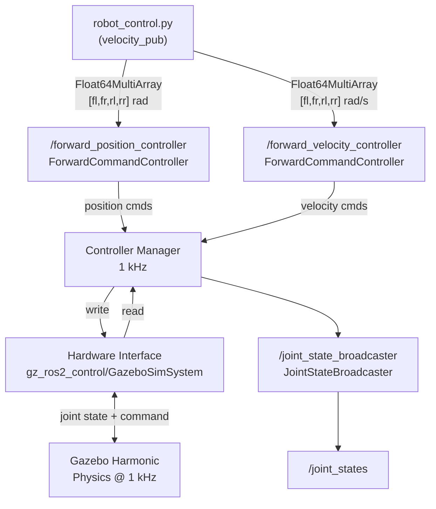
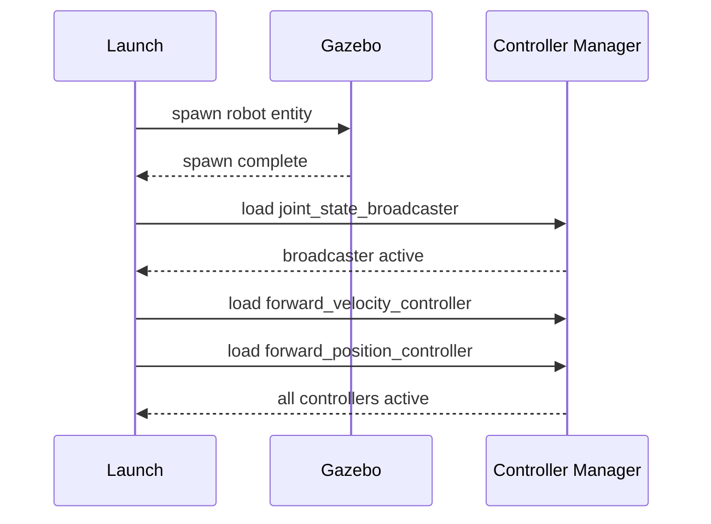
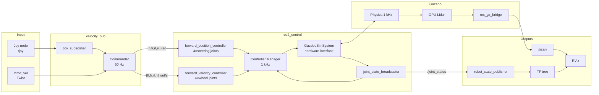

# Four-Wheel-Steered (FWS) Robot — ROS 2 + Gazebo Harmonic

A complete simulation workspace for a four-wheel-steered ground robot using **ROS 2 Humble** and **Gazebo Harmonic**. The robot has independent steering on all four wheels, enabling advanced locomotion modes (crab walk, sideways translation, pivot turn) through a ros2_control-based actuation pipeline.

---

## Workspace structure

```
fws_robot_harmonic/
└── src/
    ├── fws_robot_description/   ← URDF/Xacro, meshes, ros2_control, RViz config
    ├── fws_robot_sim/           ← Gazebo world + bringup launch
    └── velocity_pub/            ← Kinematics & velocity command node
```

### Package summary

| Package | Build system | Role |
|---|---|---|
| `fws_robot_description` | CMake | Robot model (URDF/Xacro), meshes, hardware interface declaration, controller YAML |
| `fws_robot_sim` | CMake | Gazebo world, spawn launch, controller loading sequence |
| `velocity_pub` | CMake | Python control node — reads `/cmd_vel` or joystick, runs kinematics, writes controller commands |

---

## Robot overview

### Physical parameters

| Parameter | Value |
|---|---|
| Wheel base (front → rear) | 0.156 m |
| Wheel separation (left ↔ right) | 0.122 m |
| Wheel radius | 0.026 m |
| Steering track | ≈ 0.062 m |
| Chassis mass | 1.2 kg |
| Wheel mass | 0.05 kg each |
| Steering link mass | 0.15 kg each |

### Kinematic chain

```
base_footprint
    └── base_link
            ├── fl_steering_link  ──(fl_steering_joint)──  fl_wheel_link
            ├── fr_steering_link  ──(fr_steering_joint)──  fr_wheel_link
            ├── rl_steering_link  ──(rl_steering_joint)──  rl_wheel_link
            ├── rr_steering_link  ──(rr_steering_joint)──  rr_wheel_link
            ├── lidar_base_link
            └── lidar_head_link
```

### Joint types and limits

| Joint | Type | Limit |
|---|---|---|
| `*_steering_joint` (×4) | Revolute | ±2.1 rad, 5 N·m, 6.28 rad/s |
| `*_wheel_joint` (×4) | Continuous | 1.5 N·m, 20 rad/s |

### Sensor

| Sensor | Topic | Type | Rate | Range |
|---|---|---|---|---|
| YDLidar (GPU-accel.) | `/scan` | `sensor_msgs/LaserScan` | 30 Hz | 0.2 – 30 m, 2800 rays |

---

## ros2_control architecture

This is the core of the actuation pipeline. Everything from Gazebo physics to the control node is wired together through ros2_control.

### Conceptual layers



### Hardware interface — `fws_robot.ros2_control.xacro`

The hardware interface is declared inside the robot's Xacro tree and loaded by the Controller Manager at startup:

```xml
<ros2_control name="GazeboSystem" type="system">
  <hardware>
    <plugin>gz_ros2_control/GazeboSimSystem</plugin>
  </hardware>

  <!-- Four steering joints — position command + position/velocity state -->
  <joint name="fl_steering_joint"> ... </joint>
  <joint name="fr_steering_joint"> ... </joint>
  <joint name="rl_steering_joint"> ... </joint>
  <joint name="rr_steering_joint"> ... </joint>

  <!-- Four wheel joints — velocity command + position/velocity state -->
  <joint name="fl_wheel_joint"> ... </joint>
  <joint name="fr_wheel_joint"> ... </joint>
  <joint name="rl_wheel_joint"> ... </joint>
  <joint name="rr_wheel_joint"> ... </joint>
</ros2_control>
```

`gz_ros2_control/GazeboSimSystem` is the Gazebo-specific hardware plugin. It reads joint states from Gazebo and writes back the commanded values at each control cycle. In a real-robot deployment the only change required is swapping this plugin for the physical hardware driver — the rest of the stack stays identical.

### Controller Manager — `fws_robot_sim.yaml`

The Controller Manager is the central dispatcher. It runs at **1000 Hz**, matching the Gazebo physics step size, so every physics tick has a fresh command.

```yaml
controller_manager:
  ros__parameters:
    update_rate: 1000            # Hz — must match Gazebo step size (1 ms)

    joint_state_broadcaster:
      type: joint_state_broadcaster/JointStateBroadcaster

    forward_velocity_controller:
      type: forward_command_controller/ForwardCommandController

    forward_position_controller:
      type: forward_command_controller/ForwardCommandController
```

### Controllers in detail

#### `joint_state_broadcaster`

Reads **all** joint positions and velocities from the hardware interface and publishes them on `/joint_states`. This is consumed by `robot_state_publisher` to maintain the TF tree (`base_footprint → … → lidar_head_link`).

```
Hardware interface  →  joint_state_broadcaster  →  /joint_states  →  robot_state_publisher  →  TF
```

#### `forward_position_controller` — steering

Controls the **four steering joints** with a direct position setpoint.

```yaml
forward_position_controller:
  ros__parameters:
    joints:
      - fl_steering_joint
      - fr_steering_joint
      - rl_steering_joint
      - rr_steering_joint
    interface_name: position
```

- **Input topic:** `/forward_position_controller/commands` (`std_msgs/Float64MultiArray`)
- **Array layout:** `[fl, fr, rl, rr]` in radians
- **Command range:** −3.14 … +3.14 rad
- **State interfaces exposed:** `position`, `velocity`

#### `forward_velocity_controller` — wheels

Controls the **four wheel joints** with a direct velocity setpoint.

```yaml
forward_velocity_controller:
  ros__parameters:
    joints:
      - fl_wheel_joint
      - fr_wheel_joint
      - rl_wheel_joint
      - rr_wheel_joint
    interface_name: velocity
```

- **Input topic:** `/forward_velocity_controller/commands` (`std_msgs/Float64MultiArray`)
- **Array layout:** `[fl, fr, rl, rr]` in rad/s
- **Command range:** −1 … +1 (normalised, maps to ±20 rad/s at the joint)
- **State interfaces exposed:** `position`, `velocity`

### Controller loading sequence

Controllers are loaded and activated sequentially in the launch file to respect dependency order:



The `joint_state_broadcaster` must be active before the velocity/position controllers start because the hardware interface exposes joint state data only once the broadcaster has registered its read handles.

### Interface summary

```
┌─────────────────────────────────────────────────────────────┐
│                    Controller Manager (1 kHz)               │
│                                                             │
│  ┌─────────────────────┐   ┌─────────────────────────────┐  │
│  │ forward_position_   │   │  forward_velocity_          │  │
│  │ controller          │   │  controller                 │  │
│  │ joints: 4×steering  │   │  joints: 4×wheel            │  │
│  │ iface:  position    │   │  iface:  velocity           │  │
│  └────────┬────────────┘   └──────────────┬──────────────┘  │
│           │  write cmd                    │  write cmd       │
│  ┌────────▼──────────────────────────────▼──────────────┐  │
│  │            Hardware Interface                         │  │
│  │       gz_ros2_control/GazeboSimSystem                 │  │
│  └────────────────────────┬──────────────────────────────┘  │
└───────────────────────────│─────────────────────────────────┘
                            │  joint cmd / joint state
                    ┌───────▼────────┐
                    │ Gazebo Harmonic │
                    │  Physics 1 kHz  │
                    └────────────────┘
```

---

## Control node — `robot_control.py`

The `Commander` node runs at **50 Hz** and bridges `/cmd_vel` (Twist) to the two controller topics.

> For a detailed derivation of the inverse kinematics and the full `cmd_vel` → low-level command pipeline see [src/control_pipeline.md](src/control_pipeline.md).

### Steering modes

| Mode | Trigger | Steering | Use case |
|---|---|---|---|
| **Opposite phase** | Button A | Front and rear steer in opposite directions | Crab walk / obstacle avoidance |
| **In-phase** | Button LB | All four wheels steer to the same angle | Pure lateral translation |
| **Pivot turn** | Button RB | Diagonal pairs steer opposite; wheels counter-rotate | Tight 180° turn |
| **Default** | — | All angles and velocities zero | Stop / idle |

### Kinematics (opposite-phase example)

$$\alpha_{front} = \arctan\!\left(\frac{\omega \cdot \frac{l}{2}}{v_x}\right), \quad \alpha_{rear} = -\alpha_{front}$$

$$v_{wheel} = \frac{\sqrt{v_x^2 + (\omega \cdot d)^2}}{r_{wheel}}$$

where $l$ is the wheel base, $d$ is the steering track, and $r_{wheel}$ is the wheel radius.

### Topic map

| Topic | Direction | Message type | Publisher / Subscriber |
|---|---|---|---|
| `/cmd_vel` | in | `geometry_msgs/Twist` | external → Commander |
| `/joy` | in | `sensor_msgs/Joy` | Joy node → Joy_subscriber |
| `/forward_position_controller/commands` | out | `std_msgs/Float64MultiArray` | Commander → FPC |
| `/forward_velocity_controller/commands` | out | `std_msgs/Float64MultiArray` | Commander → FVC |
| `/joint_states` | monitor | `sensor_msgs/JointState` | JSB → RSP |
| `/scan` | out | `sensor_msgs/LaserScan` | Gazebo bridge → consumers |

---

## Running the simulation

### 1 — Start the Docker container (Linux or Windows WSL)

```bash
cd Robotics_academy/linux(or windows)
xhost +local:docker          # grant X11 access
docker compose up -d
docker exec -it ros2_course_container bash
```

### 2 — Build the workspace (inside the container)

```bash
cd ~/ros2_ws/examples/fws_robot_harmonic
colcon build --symlink-install
source install/setup.bash
```

### 3 — Launch Gazebo + robot + controllers

```bash
ros2 launch fws_robot_sim fws_robot_spawn.launch.py
```

This single command:
- Starts Gazebo Harmonic with `fws_robot_world.sdf`
- Processes the Xacro and spawns the robot at (0, 0, 0.07)
- Launches `robot_state_publisher`
- Bridges `/scan` from Gazebo to ROS 2
- Launches RViz
- Sequentially loads all three controllers

### 4 — Launch the control node (separate terminal)

```bash
# Inside the container (new terminal)
docker exec -it ros2_course_container bash
source ~/ros2_ws/examples/fws_robot_harmonic/install/setup.bash

ros2 launch velocity_pub four_ws_control.launch.py use_sim_time:=true
```

### 5 — Send velocity commands manually or with teleopkeyboard:

```bash
# You can use teleop_keyboard for interactive control
# It will open a prompt where you can use keys to drive the robot and for imposing rotations
ros2 run teleop_keyboard teleop_keyboard

# Another option is to publish directly on /cmd_vel with custom values. For example:
# Drive forward
ros2 topic pub /cmd_vel geometry_msgs/msg/Twist \
    "{linear: {x: 0.3}, angular: {z: 0.0}}" -r 10

# Rotate in place
ros2 topic pub /cmd_vel geometry_msgs/msg/Twist \
    "{linear: {x: 0.0}, angular: {z: 1.0}}" -r 10

# Stop
ros2 topic pub /cmd_vel geometry_msgs/msg/Twist "{}" -r 10
```

### 6 — Inspect the ros2_control stack

```bash
# List all loaded controllers and their state
ros2 control list_controllers

# List all hardware interfaces (command + state)
ros2 control list_hardware_interfaces

# Check controller manager status
ros2 control list_hardware_components
```

Expected output of `list_controllers`:
```
joint_state_broadcaster[joint_state_broadcaster/JointStateBroadcaster] active
forward_velocity_controller[forward_command_controller/ForwardCommandController] active
forward_position_controller[forward_command_controller/ForwardCommandController] active
```

### 7 — Monitor joint states

```bash
ros2 topic echo /joint_states
ros2 topic echo /forward_position_controller/commands
ros2 topic echo /forward_velocity_controller/commands
```

### 8 — View TF tree

```bash
ros2 run tf2_tools view_frames
```

---

## Full system diagram


