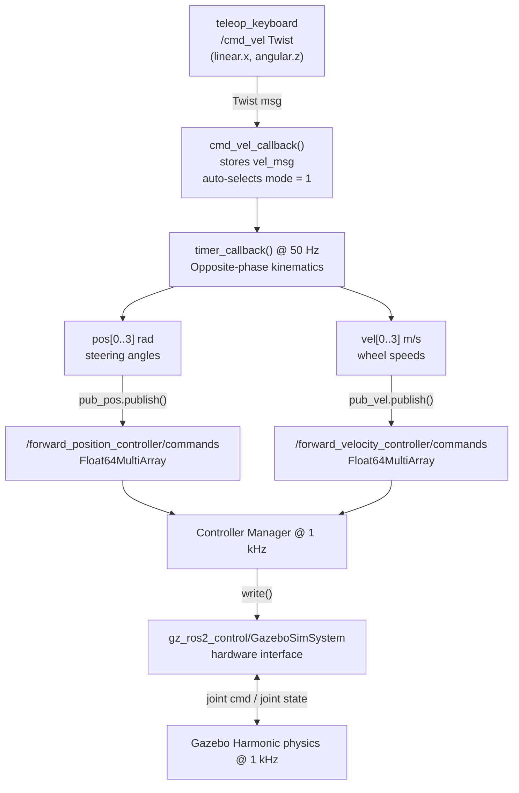
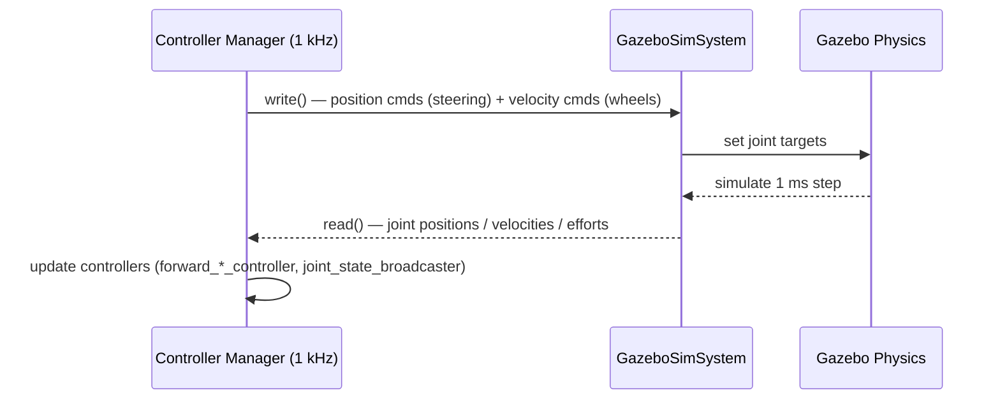

# Control Pipeline — `cmd_vel` to Low-Level Motor Commands

This document traces the complete path from a `geometry_msgs/Twist` message on `/cmd_vel` (as published by `teleop_keyboard`) down to the individual joint commands that drive the four steering servos and four wheel motors.

---

## Overview



---

## Step 1 — Receiving `/cmd_vel`

`robot_control.py` — `cmd_vel_callback()` (lines 38–51)

```python
def cmd_vel_callback(self, msg):
    global vel_msg, mode_selection

    vel_msg.linear.x  = msg.linear.x   # forward  [m/s]
    vel_msg.linear.y  = msg.linear.y   # lateral  [m/s]
    vel_msg.angular.z = msg.angular.z  # yaw rate [rad/s]

    # Auto-select opposite-phase when teleop sends a non-zero command.
    if mode_selection == 4 and (
        abs(msg.linear.x)  > 1e-6 or
        abs(msg.linear.y)  > 1e-6 or
        abs(msg.angular.z) > 1e-6
    ):
        mode_selection = 1
```

`teleop_keyboard` only publishes non-zero linear/angular components and never sets a joystick mode button, so `mode_selection` remains **4** (idle) until the first keypress. The guard above guarantees an automatic transition to **mode 1 (opposite phase)** on the very first non-zero `cmd_vel` and it stays there for the rest of the session.

---

## Step 2 — Inverse Kinematics for Opposite-Phase Mode (`mode_selection == 1`)

`robot_control.py` — `timer_callback()` lines 53–124, branch `mode_selection == 1`.

---

### 2.0 — Robot geometry and coordinate frame

```
                  x (forward)
                  ↑
                  │
   FL ────────────┼──────────── FR
   │              │              │
   │      d/2     │     d/2      │
   │←────────────CoG────────────→│   y (left)
   │              │              │
   │              │              │
   RL ────────────┼──────────── RR
```

| Symbol | Parameter | Value |
|---|---|---|
| $L$ | `wheel_base` — front-to-rear axle distance | 0.156 m |
| $W$ | `wheel_separation` — left-to-right hub distance | 0.122 m |
| $r$ | `wheel_radius` | 0.026 m |
| $y_{off}$ | `wheel_steering_y_offset` — lateral offset between steering pivot axis and wheel contact point | 0.030 m |
| $d$ | `steering_track` $= W - 2\,y_{off}$ — lateral distance between the two steering pivot axes | 0.062 m |

Each wheel is located at:

| Wheel | Position relative to CoG |
|---|---|
| FL | $\left(+\dfrac{L}{2},\; +\dfrac{d}{2}\right)$ (using pivot axis, not hub) |
| FR | $\left(+\dfrac{L}{2},\; -\dfrac{d}{2}\right)$ |
| RL | $\left(-\dfrac{L}{2},\; +\dfrac{d}{2}\right)$ |
| RR | $\left(-\dfrac{L}{2},\; -\dfrac{d}{2}\right)$ |

The inputs from `/cmd_vel` are:
- $v_x$ — desired longitudinal velocity of the CoG [m/s]
- $\omega$ — desired yaw rate of the chassis [rad/s]

The IK problem: given $(v_x,\,\omega)$, find the four steering angles $\alpha_i$ [rad] and four wheel speeds $v_i$ [m/s] such that every wheel rolls without slip.

---

### 2.1 — Rigid-body velocity field

For a rigid body moving in the plane, the velocity of any point $P$ at position $\mathbf{r}_P = (x_P, y_P)$ relative to the CoG is:

$$\mathbf{v}_P = \mathbf{v}_{CoG} + \boldsymbol{\omega} \times \mathbf{r}_P$$

With $\mathbf{v}_{CoG} = (v_x,\,0)$ and $\boldsymbol{\omega} = (0,\,0,\,\omega)$:

$$\mathbf{v}_P = \begin{pmatrix} v_x \\ 0 \end{pmatrix} + \begin{pmatrix} 0 \\ 0 \\ \omega \end{pmatrix} \times \begin{pmatrix} x_P \\ y_P \\ 0 \end{pmatrix} = \begin{pmatrix} v_x - \omega\,y_P \\ \omega\,x_P \end{pmatrix}$$

Applying this to each steering pivot:

| Wheel | $x_P$ | $y_P$ | $v_{P,x}$ | $v_{P,y}$ |
|---|---|---|---|---|
| FL | $+L/2$ | $+d/2$ | $v_x - \omega\,d/2$ | $+\omega\,L/2$ |
| FR | $+L/2$ | $-d/2$ | $v_x + \omega\,d/2$ | $+\omega\,L/2$ |
| RL | $-L/2$ | $+d/2$ | $v_x - \omega\,d/2$ | $-\omega\,L/2$ |
| RR | $-L/2$ | $-d/2$ | $v_x + \omega\,d/2$ | $-\omega\,L/2$ |

---

### 2.2 — No-slip constraint and steering angle

For a rolling wheel to satisfy the no-slip constraint, its heading direction must be **aligned with its velocity vector**. The steering angle $\alpha_i$ is therefore the angle of $\mathbf{v}_{P_i}$ relative to the robot's $x$-axis:

$$\alpha_i = \operatorname{atan2}(v_{P_i,y},\; v_{P_i,x})$$

Substituting from the table above:

$$\alpha_{FL} = \operatorname{atan2}\!\left(\omega\frac{L}{2},\; v_x - \omega\frac{d}{2}\right)$$

$$\alpha_{FR} = \operatorname{atan2}\!\left(\omega\frac{L}{2},\; v_x + \omega\frac{d}{2}\right)$$

$$\alpha_{RL} = \operatorname{atan2}\!\left(-\omega\frac{L}{2},\; v_x - \omega\frac{d}{2}\right)$$

$$\alpha_{RR} = \operatorname{atan2}\!\left(-\omega\frac{L}{2},\; v_x + \omega\frac{d}{2}\right)$$

Observe that $\alpha_{RL} = -\alpha_{FL}$ and $\alpha_{RR} = -\alpha_{FR}$ because the rear $y$-component is negated. This is the **opposite-phase** relationship: front and rear steer symmetrically in opposite directions.

#### From `atan2` to `atan`

The code uses `math.atan` (single argument, returns $(-\pi/2, \pi/2)$) rather than `atan2`. This is valid because:

$$\operatorname{atan2}(A, B) = \arctan\!\left(\frac{A}{B}\right) \quad \text{when } B > 0$$

In practice, when $v_x > 0$ (forward driving) the denominator $v_x \pm \omega d/2$ stays positive for any reasonable $\omega$. The code introduces the auxiliary variables:

$$a_0 = 2\,v_x + \omega\,d \qquad a_1 = 2\,v_x - \omega\,d$$

These are simply $2\,(v_x \pm \omega d/2)$, i.e., the denominators scaled by 2. Factoring out the 2:

$$\alpha_{FL} = \arctan\!\left(\frac{\omega L/2}{v_x - \omega d/2}\right) = \arctan\!\left(\frac{\omega L}{2v_x - \omega d}\right) = \arctan\!\left(\frac{\omega\,L}{a_1}\right)$$

Matching with the rigid-body result:

$$\alpha_{FL} = \arctan\!\left(\frac{\omega\,L/2}{v_x - \omega\,d/2}\right) = \arctan\!\left(\frac{\omega\,L}{2\,v_x - \omega\,d}\right) = \arctan\!\left(\frac{\omega\,L}{a_1}\right)$$

$$\alpha_{FR} = \arctan\!\left(\frac{\omega\,L/2}{v_x + \omega\,d/2}\right) = \arctan\!\left(\frac{\omega\,L}{2\,v_x + \omega\,d}\right) = \arctan\!\left(\frac{\omega\,L}{a_0}\right)$$

The final opposite-phase steering law is:

$$\boxed{\alpha_{front,left} = \arctan\!\left(\frac{\omega\,L}{2\,v_x + \omega\,d}\right), \qquad \alpha_{front,right} = \arctan\!\left(\frac{\omega\,L}{2\,v_x - \omega\,d}\right)}$$

$$\boxed{\alpha_{rear,left} = -\alpha_{front,left}, \qquad \alpha_{rear,right} = -\alpha_{front,right}}$$

Division-by-zero guard: when $a_0 = 0$ or $a_1 = 0$ (i.e., $v_x = 0$ and $\omega \neq 0$) the CoG is spinning in place and the concept of steering toward an ICR breaks down for this mode; the angle is set to 0. Pure spin is handled by mode 3 (pivot turn).

---

### 2.3 — Equivalent ICR interpretation

The same result can be derived geometrically. In a steady turn the robot rotates about an Instantaneous Centre of Rotation (ICR) at lateral distance $R$ from the CoG. The no-slip condition for each wheel is that it points tangentially to its circle about the ICR.

For the front-left wheel at position $(L/2,\; y_{FL})$ relative to CoG, the ICR is at $(0,\; -R)$:

$$\tan(\alpha_{FL}) = \frac{L/2}{R + y_{FL}}$$

For opposite-phase steering the rear-left wheel at $(-L/2,\; y_{RL})$:

$$\tan(\alpha_{RL}) = \frac{-L/2}{R + y_{RL}}= -\tan(\alpha_{FL}) \quad \Longrightarrow \quad \alpha_{RL} = -\alpha_{FL}$$

The turn radius $R$ and the cmd_vel inputs are related by:

$$R = \frac{v_x}{\omega} \quad \Longrightarrow \quad \tan(\alpha_{FL}) = \frac{L/2}{\dfrac{v_x}{\omega} + \dfrac{d}{2}} = \frac{\omega\,L/2}{v_x + \omega\,d/2} = \frac{\omega\,L}{2\,v_x + \omega\,d}$$

This confirms the velocity-ratio formula derived in §2.2.

---

### 2.4 — Wheel speed computation

The required speed of each wheel equals the magnitude of its hub velocity vector (computed in §2.1), with the sign of $v_x$ applied to set the rolling direction:

$$v_i = \operatorname{sign}(v_x) \cdot \lVert \mathbf{v}_{P_i} \rVert = \operatorname{sign}(v_x) \cdot \sqrt{v_{P_i,x}^2 + v_{P_i,y}^2}$$

Substituting from the rigid-body table:

$$v_{FL} = v_{RL} = \operatorname{sign}(v_x)\sqrt{\left(v_x - \omega\frac{d}{2}\right)^2 + \left(\omega\frac{L}{2}\right)^2}$$

$$v_{FR} = v_{RR} = \operatorname{sign}(v_x)\sqrt{\left(v_x + \omega\frac{d}{2}\right)^2 + \left(\omega\frac{L}{2}\right)^2}$$

#### Why `sign(vx)` is necessary

`math.hypot` (and $\sqrt{\cdot}$) is always non-negative. Without the sign factor, a command $v_x < 0$ would produce positive wheel speeds, driving the robot forward instead of backward. Multiplying by $\operatorname{sign}(v_x)$ maps the magnitude to the correct direction.

#### Steering-pivot offset correction

The quantities above give the velocity at the **steering pivot axis**, which is inset $y_{off} = 0.030\ \text{m}$ from the wheel contact point. Because the pivot axis is not exactly at the wheel, there is a small additional tangential velocity at the wheel contact due to the arm $y_{off}$:

$$\Delta v = \omega \cdot y_{off}$$

This term adds to the outer (right) wheels and subtracts from the inner (left) wheels during a left turn ($\omega > 0$), giving the full corrected expressions:

$$\boxed{v_{FL} = v_{RL} = \operatorname{sign}(v_x)\sqrt{\left(v_x - \omega\frac{d}{2}\right)^2 + \left(\omega\frac{L}{2}\right)^2} - \omega\,y_{off}}$$

$$\boxed{v_{FR} = v_{RR} = \operatorname{sign}(v_x)\sqrt{\left(v_x + \omega\frac{d}{2}\right)^2 + \left(\omega\frac{L}{2}\right)^2} + \omega\,y_{off}}$$

In Python (`math.hypot(a, b)` $= \sqrt{a^2+b^2}$):

```python
vel_steerring_offset = vel_msg.angular.z * self.wheel_steering_y_offset   # ω·y_off
sign = np.sign(vel_msg.linear.x)

self.vel[0] = sign*math.hypot(vel_msg.linear.x - vel_msg.angular.z*self.steering_track/2,
                               vel_msg.angular.z*self.wheel_base/2) - vel_steerring_offset  # FL
self.vel[1] = sign*math.hypot(vel_msg.linear.x + vel_msg.angular.z*self.steering_track/2,
                               vel_msg.angular.z*self.wheel_base/2) + vel_steerring_offset  # FR
self.vel[2] = self.vel[0]   # RL = FL
self.vel[3] = self.vel[1]   # RR = FR
```

> **Array order:** `vel[0]=FL`, `vel[1]=FR`, `vel[2]=RL`, `vel[3]=RR`

Note that RL and FL have the same speed because they are at the same lateral distance from the ICR; the same holds for RR and FR. This is a direct consequence of the 4WS symmetric geometry.

---

### 2.5 — Summary of IK solution

Given $(v_x, \omega)$, the IK outputs are:

**Steering angles** (radians):

$$\alpha_{FL} = \arctan\!\left(\frac{\omega\,L}{2\,v_x + \omega\,d}\right), \quad \alpha_{FR} = \arctan\!\left(\frac{\omega\,L}{2\,v_x - \omega\,d}\right)$$

$$\alpha_{RL} = -\alpha_{FL}, \quad \alpha_{RR} = -\alpha_{FR}$$

**Wheel speeds** (m/s at hub):

$$v_{FL} = v_{RL} = \operatorname{sign}(v_x)\sqrt{\left(v_x - \tfrac{\omega d}{2}\right)^2 + \left(\tfrac{\omega L}{2}\right)^2} - \omega\,y_{off}$$

$$v_{FR} = v_{RR} = \operatorname{sign}(v_x)\sqrt{\left(v_x + \tfrac{\omega d}{2}\right)^2 + \left(\tfrac{\omega L}{2}\right)^2} + \omega\,y_{off}$$

with $L = 0.156\ \text{m}$, $d = 0.062\ \text{m}$, $y_{off} = 0.030\ \text{m}$.

---

## Step 3 — Publishing to the Controller Topics

At the end of every 50 Hz tick (lines 119–124) both arrays are packaged into `Float64MultiArray` messages and published:

```python
pos_array = Float64MultiArray(data=self.pos)   # [FL, FR, RL, RR] rad
vel_array = Float64MultiArray(data=self.vel)   # [FL, FR, RL, RR] m/s

self.pub_pos.publish(pos_array)   # → /forward_position_controller/commands
self.pub_vel.publish(vel_array)   # → /forward_velocity_controller/commands

self.pos[:] = 0   # reset — next tick starts from zero
self.vel[:] = 0
```

The reset at the end is a safety measure: if the node stops publishing the hardware sees a zero command rather than a stale non-zero value.

---

## Step 4 — `forward_position_controller` (steering)

`fws_robot_sim.yaml` — `forward_position_controller`

```yaml
forward_position_controller:
  ros__parameters:
    joints:
      - fl_steering_joint
      - fr_steering_joint
      - rl_steering_joint
      - rr_steering_joint
    interface_name: position
```

This is a `ForwardCommandController`: it copies the incoming `Float64MultiArray` values straight to the `position` command interface of the four steering joints — **no PID, no trajectory interpolation**. The underlying Gazebo joint controller handles the servo dynamics.

- **Input topic:** `/forward_position_controller/commands`
- **Message type:** `std_msgs/Float64MultiArray`
- **Unit:** radians, range −3.14 … +3.14 rad

---

## Step 5 — `forward_velocity_controller` (wheels)

`fws_robot_sim.yaml` — `forward_velocity_controller`

```yaml
forward_velocity_controller:
  ros__parameters:
    joints:
      - fl_wheel_joint
      - fr_wheel_joint
      - rl_wheel_joint
      - rr_wheel_joint
    interface_name: velocity
```

Same pass-through design. The kinematics-computed wheel speeds (m/s) are forwarded directly to the `velocity` command interface of the four wheel joints.

- **Input topic:** `/forward_velocity_controller/commands`
- **Message type:** `std_msgs/Float64MultiArray`
- **Unit:** m/s (interpreted by `GazeboSimSystem` as the target joint velocity)

---

## Step 6 — Hardware Interface and Gazebo

`fws_robot.ros2_control.xacro` — plugin `gz_ros2_control/GazeboSimSystem`

The hardware plugin runs inside Gazebo at **1 kHz** (matching the physics step). On each tick it:

1. **Reads** current joint positions, velocities, and efforts from Gazebo and exposes them as state interfaces to the Controller Manager.
2. **Writes** the latest command interface values back to the Gazebo joint actuators.



The Controller Manager runs at 1 kHz while the control node publishes at 50 Hz. Between two control node ticks the same command is applied 20 times, which is fine because `ForwardCommandController` holds the last received value until a new message arrives.
