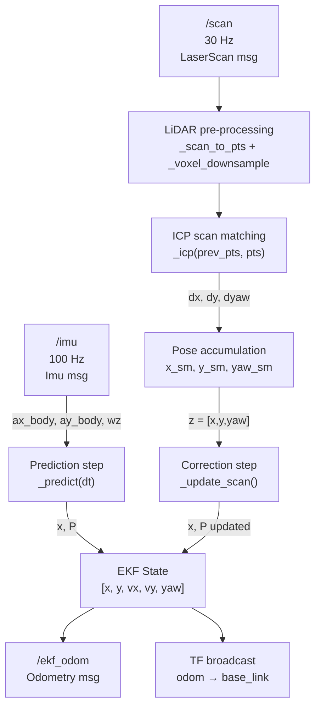

# State Estimation — EKF Node

Extended Kalman Filter that estimates the planar state of the FWS robot by fusing IMU and 2-D LiDAR data.

---

## Table of Contents

1. [Overview](#1-overview)
2. [Architecture](#2-architecture)
3. [State Vector](#3-state-vector)
4. [Sensor Inputs](#4-sensor-inputs)
5. [EKF — Step-by-Step](#5-ekf--step-by-step)
    1. [Initialisation](#51-initialisation)
    2. [Prediction (IMU)](#52-prediction-imu)
    3. [LiDAR Pre-processing](#53-lidar-pre-processing)
    4. [ICP Scan Matching](#54-icp-scan-matching)
    5. [Pose Accumulation](#55-pose-accumulation)
    6. [Correction (LiDAR)](#56-correction-lidar)
6. [Noise Parameters](#6-noise-parameters)
7. [Output](#7-output)
8. [Build & Run](#8-build--run)
9. [Tuning Guide](#9-tuning-guide)

---

## 1. Overview

The node implements a **sensor-fusion loop** in which:

- The **IMU** (100 Hz) drives the high-frequency **prediction** step — it provides body-frame linear acceleration and yaw rate that propagate position, velocity, and heading forward in time.
- The **2-D LiDAR** (30 Hz) drives the low-frequency **correction** step — consecutive scans are matched with ICP to obtain a relative displacement, which is accumulated into an odometry-like pose and used to correct drift accumulated during prediction.

---

## 2. Architecture



---

## 3. State Vector

$$
\mathbf{x} =
\begin{bmatrix}
x \\ y \\ v_x \\ v_y \\ \psi
\end{bmatrix}
$$

| Index | Symbol | Description |
|-------|--------|-------------|
| 0 | $x$ | World-frame position — East (m) |
| 1 | $y$ | World-frame position — North (m) |
| 2 | $v_x$ | World-frame velocity along x (m/s) |
| 3 | $v_y$ | World-frame velocity along y (m/s) |
| 4 | $\psi$ | Yaw angle, positive CCW (rad) |

The state covariance $\mathbf{P} \in \mathbb{R}^{5 \times 5}$ is initialised to $0.1\,\mathbf{I}$.

---

## 4. Sensor Inputs

| Topic | Type | Rate | Used fields |
|-------|------|------|-------------|
| `/imu` | `sensor_msgs/Imu` | 100 Hz | `linear_acceleration.{x,y}`, `angular_velocity.z` |
| `/scan` | `sensor_msgs/LaserScan` | 30 Hz | `ranges`, `angle_min/max`, `range_min/max` |

**IMU noise (from URDF):**

$$
\sigma_{a} = 1.7 \times 10^{-2}\ \text{m/s}^2, \qquad \sigma_{\omega} = 2 \times 10^{-4}\ \text{rad/s}
$$

---

## 5. EKF — Step-by-Step

### 5.1 Initialisation

$$
\mathbf{x}_0 = \mathbf{0}_{5 \times 1}, \qquad
\mathbf{P}_0 = 0.1\,\mathbf{I}_{5 \times 5}
$$

The scan-matching accumulated pose is also zero-initialised, so the filter assumes the robot starts at the origin of the `odom` frame.

---

### 5.2 Prediction (IMU)

Triggered by every `/imu` message. Given time step $\Delta t$:

**1 — Rotate acceleration to world frame**

The IMU delivers body-frame accelerations $(a_x^b,\, a_y^b)$.
Using the current yaw estimate $\hat{\psi}$:

$$
\begin{bmatrix} a_x^w \\ a_y^w \end{bmatrix}
= \begin{bmatrix} \cos\hat{\psi} & -\sin\hat{\psi} \\ \sin\hat{\psi} & \cos\hat{\psi} \end{bmatrix}
\begin{bmatrix} a_x^b \\ a_y^b \end{bmatrix}
$$

**2 — Nonlinear state transition** $f(\mathbf{x}, \mathbf{u})$

$$
\mathbf{x}_{k+1} = f(\mathbf{x}_k) =
\begin{bmatrix}
x_k + v_x^k \,\Delta t \\
y_k + v_y^k \,\Delta t \\
v_x^k + a_x^w \,\Delta t \\
v_y^k + a_y^w \,\Delta t \\
\psi_k + \omega_z \,\Delta t
\end{bmatrix}
$$

**3 — Linearisation** — Jacobian $\mathbf{F} = \partial f / \partial \mathbf{x}$

$$
\mathbf{F} =
\begin{bmatrix}
1 & 0 & \Delta t & 0 & 0 \\
0 & 1 & 0 & \Delta t & 0 \\
0 & 0 & 1 & 0 & (-a_x^b \sin\hat{\psi} - a_y^b \cos\hat{\psi})\,\Delta t \\
0 & 0 & 0 & 1 & (a_x^b \cos\hat{\psi} - a_y^b \sin\hat{\psi})\,\Delta t \\
0 & 0 & 0 & 0 & 1
\end{bmatrix}
$$

The off-diagonal terms in column 4 (yaw) capture how a change in heading rotates the body-frame acceleration into different world-frame components.

**4 — Covariance propagation**

$$
\mathbf{P}_{k+1}^{-} = \mathbf{F}\,\mathbf{P}_k\,\mathbf{F}^\top + \mathbf{Q}
$$

---

### 5.3 LiDAR Pre-processing

**Polar → Cartesian conversion**

For each valid range $r_i$ at angle $\alpha_i$:

$$
\begin{bmatrix} p_x^i \\ p_y^i \end{bmatrix}
= r_i \begin{bmatrix} \cos\alpha_i \\ \sin\alpha_i \end{bmatrix},
\qquad r_{\min} < r_i < r_{\max}
$$

The scan has 2800 samples over $[-\pi,\,\pi]$.

**Voxel downsampling**

The point cloud is downsampled to one point per 5 cm grid cell:

$$
\mathbf{k}_i = \left\lfloor \frac{\mathbf{p}_i}{d_{\text{voxel}}} \right\rfloor, \quad d_{\text{voxel}} = 0.05\ \text{m}
$$

Duplicate keys are removed, reducing 2800 points to typically 200–500 while preserving geometric structure.

---

### 5.4 ICP Scan Matching

**Iterative Closest Point** finds the 2-D rigid transform $(\mathbf{R}, \mathbf{t})$ that best aligns the previous scan (source $S$) to the current scan (target $T$).

Each iteration $\ell$:

**Step A — Nearest-neighbour correspondence** (KD-tree, $O(n \log n)$)

$$
j^* = \arg\min_{j} \| \mathbf{s}_i - \mathbf{t}_j \|^2 \quad \forall\, \mathbf{s}_i \in S
$$

**Step B — Closed-form optimal rotation & translation (SVD)**

Compute centroids and cross-covariance:

$$
\boldsymbol{\mu}_S = \frac{1}{n}\sum_i \mathbf{s}_i, \qquad
\boldsymbol{\mu}_T = \frac{1}{n}\sum_i \mathbf{t}_{j^*_i}
$$

$$
\mathbf{H} = \sum_i (\mathbf{s}_i - \boldsymbol{\mu}_S)^\top (\mathbf{t}_{j^*_i} - \boldsymbol{\mu}_T)
$$

$$
\mathbf{H} = \mathbf{U}\,\boldsymbol{\Sigma}\,\mathbf{V}^\top \quad \text{(SVD)}
$$

$$
\mathbf{R}^* = \mathbf{V}\,\mathbf{U}^\top, \qquad
\mathbf{t}^* = \boldsymbol{\mu}_T - \mathbf{R}^*\,\boldsymbol{\mu}_S
$$

A reflection check enforces $\det(\mathbf{R}^*) = +1$.

**Step C — Apply transform and accumulate**

$$
S \leftarrow \mathbf{R}^* S + \mathbf{t}^*
$$

$$
\mathbf{R}_\text{acc} \leftarrow \mathbf{R}^*\,\mathbf{R}_\text{acc}, \qquad
\mathbf{t}_\text{acc} \leftarrow \mathbf{R}^*\,\mathbf{t}_\text{acc} + \mathbf{t}^*
$$

**Convergence criterion** (max 30 iterations):

$$
\|\mathbf{t}^*\| < 10^{-4}\ \text{m} \quad \text{and} \quad |\Delta\psi| < 10^{-4}\ \text{rad}
$$

**Output** — relative displacement in the source (previous scan) frame:

$$
(dx,\; dy,\; d\psi) = \bigl(t_{\text{acc},x},\; t_{\text{acc},y},\; \operatorname{arctan2}(R_{\text{acc},10},\; R_{\text{acc},00})\bigr)
$$

---

### 5.5 Pose Accumulation

The scan-matching frame-to-frame displacement is composed into a running world-frame pose $\mathbf{z}_\text{sm} = (x_\text{sm},\, y_\text{sm},\, \psi_\text{sm})$:

$$
\begin{bmatrix} x_\text{sm} \\ y_\text{sm} \end{bmatrix}
\leftarrow
\begin{bmatrix} x_\text{sm} \\ y_\text{sm} \end{bmatrix}
+
\begin{bmatrix} \cos\psi_\text{sm} & -\sin\psi_\text{sm} \\ \sin\psi_\text{sm} & \cos\psi_\text{sm} \end{bmatrix}
\begin{bmatrix} dx \\ dy \end{bmatrix}
$$

$$
\psi_\text{sm} \leftarrow \psi_\text{sm} + d\psi
$$

This rotates the body-frame relative displacement into world frame before adding it to the accumulated position, exactly mirroring SE(2) pose composition.

---

### 5.6 Correction (LiDAR)

The accumulated scan pose $\mathbf{z}_\text{sm}$ is treated as a direct observation of $(x, y, \psi)$.

**Measurement model** (linear in state):

$$
\mathbf{z} = \mathbf{H}\,\mathbf{x} + \boldsymbol{\nu}, \qquad \boldsymbol{\nu} \sim \mathcal{N}(\mathbf{0}, \mathbf{R})
$$

$$
\mathbf{H} =
\begin{bmatrix}
1 & 0 & 0 & 0 & 0 \\
0 & 1 & 0 & 0 & 0 \\
0 & 0 & 0 & 0 & 1
\end{bmatrix}
$$

**Innovation**

$$
\tilde{\mathbf{y}} = \mathbf{z} - \mathbf{H}\,\hat{\mathbf{x}}^{-}
$$

The heading component is wrapped to $[-\pi, \pi]$ to avoid $2\pi$ jumps.

**Innovation covariance**

$$
\mathbf{S} = \mathbf{H}\,\mathbf{P}^{-}\,\mathbf{H}^\top + \mathbf{R}
$$

**Kalman gain**

$$
\mathbf{K} = \mathbf{P}^{-}\,\mathbf{H}^\top\,\mathbf{S}^{-1}
$$

**State update**

$$
\hat{\mathbf{x}}^{+} = \hat{\mathbf{x}}^{-} + \mathbf{K}\,\tilde{\mathbf{y}}
$$

**Covariance update**

$$
\mathbf{P}^{+} = (\mathbf{I} - \mathbf{K}\,\mathbf{H})\,\mathbf{P}^{-}
$$

---

## 6. Noise Parameters

### Process noise $\mathbf{Q}$

$$
\mathbf{Q} = \operatorname{diag}\bigl(10^{-4},\ 10^{-4},\ 5\times10^{-3},\ 5\times10^{-3},\ 10^{-4}\bigr)
$$

| State | $Q_{ii}$ | Rationale |
|-------|----------|-----------|
| $x, y$ | $10^{-4}$ | Position changes only through velocity; low direct noise |
| $v_x, v_y$ | $5\times10^{-3}$ | IMU acceleration noise $\sigma_a = 1.7\times10^{-2}$ m/s² over 10 ms gives $\approx 3\times10^{-7}$ m²/s⁴ per step; inflated to account for unmodelled dynamics |
| $\psi$ | $10^{-4}$ | Gyro noise $\sigma_\omega = 2\times10^{-4}$ rad/s |

### Measurement noise $\mathbf{R}$

$$
\mathbf{R} = \operatorname{diag}(0.05,\ 0.05,\ 0.02)
$$

| Measurement | $R_{ii}$ | Rationale |
|------------|----------|-----------|
| $x, y$ | $0.05$ | ICP position accuracy ≈ 5 cm in typical structured environments |
| $\psi$ | $0.02$ | ICP heading accuracy ≈ 1° |

---

## 7. Output

| Topic / TF | Type | Description |
|------------|------|-------------|
| `/ekf_odom` | `nav_msgs/Odometry` | Full 5-DOF state estimate stamped at IMU rate (100 Hz) |
| `odom → base_link` | TF | Transform broadcast at IMU rate, used by RViz and other nodes |

The orientation in the Odometry message and TF is expressed as a quaternion. Since only yaw is estimated, $q_x = q_y = 0$ and:

$$
q_z = \sin\frac{\psi}{2}, \qquad q_w = \cos\frac{\psi}{2}
$$

---

## 8. Build & Run

```bash
# From your ROS 2 workspace root
colcon build --packages-select state_estimation
source install/setup.bash

# In a separate terminal, launch the simulation
ros2 launch fws_robot_sim fws_robot_spawn.launch.py

# Run the EKF node
ros2 run state_estimation ekf

# Visualise in RViz (add Odometry display on /ekf_odom)
rviz2
```

Verify the node is publishing:

```bash
ros2 topic echo /ekf_odom --once
ros2 topic hz /ekf_odom          # should be ~100 Hz
```

---

## 9. Tuning Guide

| Symptom | Likely cause | Fix |
|------------------------------------------|------------------------------------------------------|----------------------------------------------------------------------|
| State diverges / oscillates | $\mathbf{Q}$ too small — EKF trusts prediction too much | Increase $Q_{v_x v_x}$, $Q_{v_y v_y}$ |
| Position lags real motion | $\mathbf{R}$ too small — correction dominates | Increase $R_{xx}$, $R_{yy}$ |
| Heading drifts despite scan matching | ICP diverging (featureless environment) | Increase $R_{\psi\psi}$; reduce voxel size |
| ICP very slow | Point cloud still too large | Increase voxel size from `0.05` to `0.10` m |
| Large jumps at scan-match correction | ICP gives wrong result (large motion between scans) | Reduce `max_iter`; seed ICP with the predicted state |
| Node crashes on first scan | Fewer than 20 valid points | Check LiDAR range limits in URDF; ensure simulation is running |
