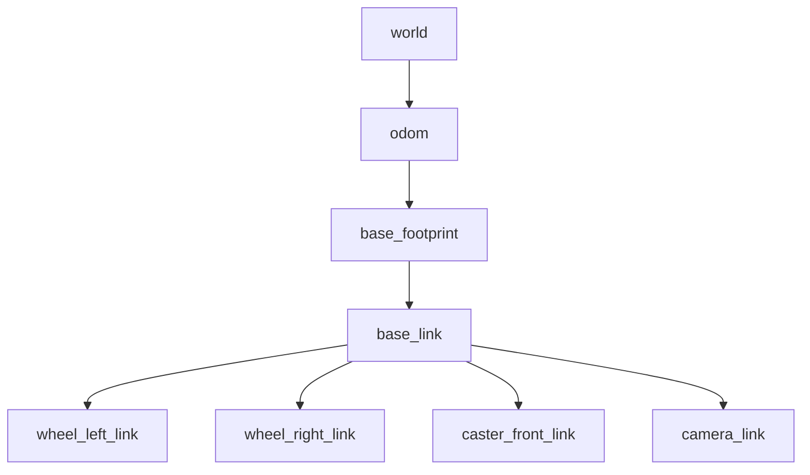

# Tutorial 1 — Introduction to TF2

> Reference: https://docs.ros.org/en/humble/Tutorials/Intermediate/Tf2/Introduction-To-Tf2.html

## What Problem Does TF2 Solve?

A robot is made up of many parts — chassis, wheels, cameras, LIDAR, arms — each living in its own **coordinate frame**. To make sense of sensor data or plan motion, you constantly need to answer questions like:

- Where is the obstacle (seen by the LIDAR in the `laser` frame) relative to the robot's `base_link`?
- Where is the robot's gripper (`hand_link`) relative to the object on the table (`world` frame)?
- What was the camera's position 200 ms ago when this image was captured?

TF2 answers all of these questions automatically, as long as each part broadcasts its transform into the shared **TF tree**.

## Core Concepts

### The Transform Tree

TF2 maintains a **tree** (directed acyclic graph) of coordinate frames. Each edge in the tree is a transform — a combination of translation and rotation — between a parent frame and a child frame.



Any transform between any two frames in the tree can be computed automatically by chaining the edges along the path between them.

### Transforms in 3D Space

A transform between frame $A$ and frame $B$ is a rigid body transformation:

$$T_{A \to B} = \begin{pmatrix} R & \mathbf{t} \\ \mathbf{0}^T & 1 \end{pmatrix} \in SE(3)$$

where $R \in SO(3)$ is the $3 \times 3$ rotation matrix and $\mathbf{t} \in \mathbb{R}^3$ is the translation vector.

In TF2, rotations are stored as **quaternions** $\mathbf{q} = (x, y, z, w)$ to avoid gimbal lock and for computational efficiency.

### Composing Transforms

To find the transform from frame $A$ to frame $C$ through an intermediate frame $B$:

$$T_{A \to C} = T_{A \to B} \cdot T_{B \to C}$$

TF2 does this automatically when you call `lookup_transform(target_frame, source_frame, time)`.

### Time Awareness

Every transform is **timestamped**. TF2 buffers a history of transforms (default: 10 seconds). This lets you query:

> "What was the transform from `camera_link` to `world` at the exact moment this image was captured?"

This is critical for sensor data that arrives with latency.

## Key API Components

| Component | Role |
|-----------|------|
| `TransformBroadcaster` | Publishes a time-varying `TransformStamped` to `/tf` |
| `StaticTransformBroadcaster` | Publishes a fixed transform once to `/tf_static` |
| `Buffer` | Stores the history of all received transforms |
| `TransformListener` | Subscribes to `/tf` and `/tf_static`, feeds the `Buffer` |
| `lookup_transform()` | Queries a transform from the `Buffer` for a given time |

## The `TransformStamped` Message

Every transform in TF2 is communicated as a `geometry_msgs/TransformStamped`:

```
std_msgs/Header header
    builtin_interfaces/Time stamp      # when this transform was valid
    string frame_id                    # parent frame name
string child_frame_id                  # child frame name
geometry_msgs/Transform transform
    geometry_msgs/Vector3 translation  # (x, y, z) in metres
    geometry_msgs/Quaternion rotation  # (x, y, z, w) unit quaternion
```

## Topics

| Topic | Type | Description |
|-------|------|-------------|
| `/tf` | `tf2_msgs/TFMessage` | Dynamic transforms (broadcasted continuously) |
| `/tf_static` | `tf2_msgs/TFMessage` | Static transforms (latched, broadcasted once) |

## Next Steps

Proceed to [02_demo_walkthrough.md](02_demo_walkthrough.md) to run the turtlesim demo and see TF2 in action.
