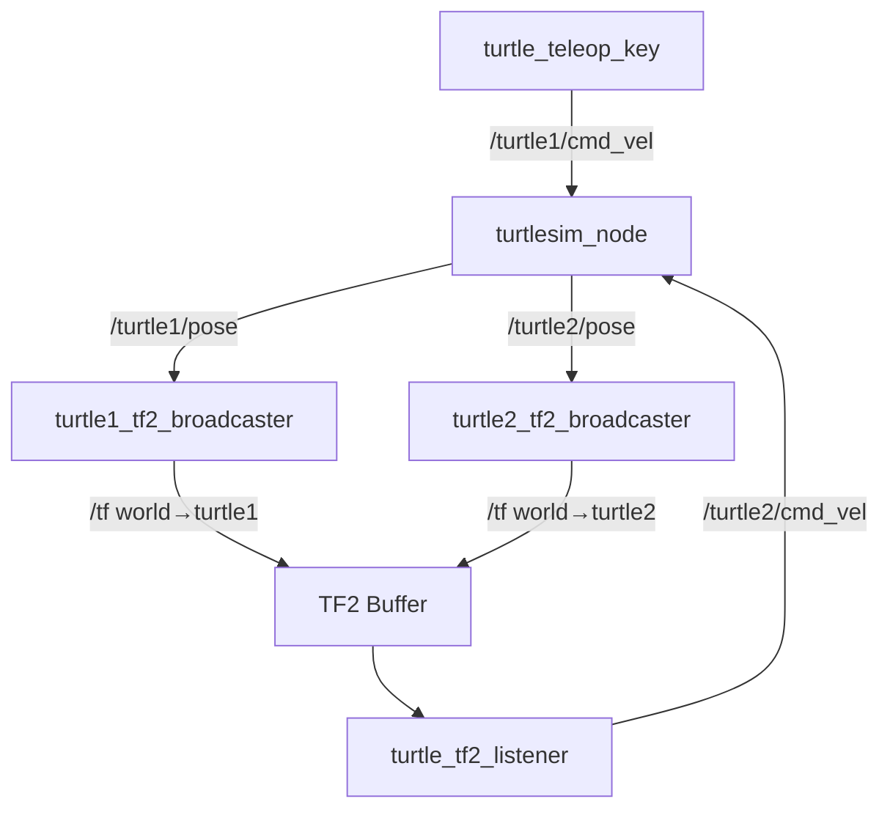
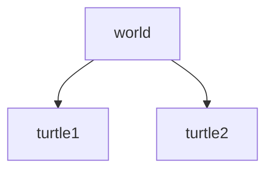

# Tutorial 2 — TF2 Demo Walkthrough

> Reference: https://docs.ros.org/en/humble/Tutorials/Intermediate/Tf2/Introduction-To-Tf2.html

## Overview

The official TF2 demo uses **turtlesim** to show a complete TF2 workflow in a simple 2D environment. Two turtles share the screen: you drive `turtle1` with the keyboard, and `turtle2` automatically follows using TF2.

This demo demonstrates:
- A **TF2 broadcaster** that publishes each turtle's pose as a coordinate frame
- A **TF2 listener** that reads the relative transform and drives `turtle2` toward `turtle1`

## System Architecture



1. Both turtles broadcast their pose as a TF2 transform (`world → turtleN`)
2. The listener queries the transform `turtle2 → turtle1` from the buffer
3. It computes the required velocity to close the gap
4. It sends that velocity to `turtle2`

## Prerequisites

```bash
source /opt/ros/humble/setup.bash

# Verify packages are installed
ros2 pkg list | grep turtle
# Should show: turtlesim, turtle_tf2_py
```

## Step-by-Step Instructions

### Step 1 — Launch the Demo

Open a terminal and run:

```bash
ros2 launch turtle_tf2_py turtle_tf2_demo.launch.py
```

You will see the turtlesim window open with `turtle1` at the center. After a moment, `turtle2` appears and begins following `turtle1`.

### Step 2 — Drive turtle1

Open a **second terminal**:

```bash
source /opt/ros/humble/setup.bash
ros2 run turtlesim turtle_teleop_key
```

Use the arrow keys to move `turtle1`. Watch `turtle2` chase it.

### Step 3 — Inspect the Transform Tree

Open a **third terminal**:

```bash
source /opt/ros/humble/setup.bash

# Print all active frames and their relationships
ros2 run tf2_tools view_frames
```

This creates a `frames.pdf` file in the current directory. Open it:

```bash
evince frames.pdf   # or: xdg-open frames.pdf
```

You will see:



### Step 4 — Echo a Transform

In the same terminal, use `tf2_echo` to print the live transform between two frames:

```bash
ros2 run tf2_ros tf2_echo world turtle1
```

Sample output:

```
At time 1234567890.123
- Translation: [5.544, 5.544, 0.000]
- Rotation: in Quaternion [0.000, 0.000, 0.000, 1.000]
```

Try the relative transform that the follower uses:

```bash
ros2 run tf2_ros tf2_echo turtle2 turtle1
```

This tells you exactly how far and in what direction `turtle1` is from `turtle2`'s perspective.

### Step 5 — Visualize in RViz

```bash
rviz2
```

In RViz:

1. Set **Fixed Frame** to `world`
2. Click **Add** → **TF**
3. Enable **Show Names** and **Show Axes**

You will see three coordinate axes moving in real time: `world`, `turtle1`, and `turtle2`.

## What the Broadcaster Does (inside `turtle_tf2_py`)

For each turtle, the broadcaster subscribes to `/turtleN/pose` and publishes:

```python
t = TransformStamped()
t.header.stamp = self.get_clock().now().to_msg()
t.header.frame_id = 'world'
t.child_frame_id = turtle_name

t.transform.translation.x = msg.x
t.transform.translation.y = msg.y
t.transform.translation.z = 0.0

# Convert 2D heading angle to quaternion
q = quaternion_from_euler(0, 0, msg.theta)
t.transform.rotation.x = q[0]
t.transform.rotation.y = q[1]
t.transform.rotation.z = q[2]
t.transform.rotation.w = q[3]

self.tf_broadcaster.sendTransform(t)
```

## What the Listener Does

The listener queries the relative transform and computes a proportional velocity command:

```python
t = self.tf_buffer.lookup_transform('turtle2', 'turtle1', rclpy.time.Time())

# Distance to target
distance = math.sqrt(t.transform.translation.x**2 + t.transform.translation.y**2)

# Angle to target
angle = math.atan2(t.transform.translation.y, t.transform.translation.x)

msg = Twist()
msg.linear.x = 0.5 * distance       # proportional linear velocity
msg.angular.z = 1.0 * angle         # proportional angular velocity
self.publisher.publish(msg)
```

## Summary

| Component | Package | What it does |
|-----------|---------|-------------|
| `turtle_tf2_broadcaster` | `turtle_tf2_py` | Publishes `world → turtleN` at each pose update |
| `turtle_tf2_listener` | `turtle_tf2_py` | Looks up `turtle2 → turtle1`, drives turtle2 |
| `tf2_echo` | `tf2_ros` | CLI tool to print live transforms |
| `view_frames` | `tf2_tools` | CLI tool to save the transform tree as PDF |

## Next Steps

Proceed to [03_static_broadcaster.md](03_static_broadcaster.md) to learn how to write your own TF2 broadcaster.
