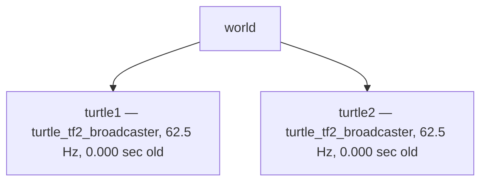

# Tutorial 6 — TF2 Tools and Debugging

> Reference: https://docs.ros.org/en/humble/Tutorials/Intermediate/Tf2/Introduction-To-Tf2.html

## Overview

TF2 provides a set of command-line and visualization tools to inspect the transform tree, monitor transform data, and diagnose problems. This tutorial covers all the essential tools you will use throughout development.

## Required Package

```bash
sudo apt install ros-humble-tf2-tools
```

> Pre-installed in the course Docker image.

---

## Tool 1 — `view_frames`

Generates a PDF visualization of the entire TF2 tree at the moment you run it.

```bash
ros2 run tf2_tools view_frames
```

**Output:** `frames.pdf` in the current directory.

**Example output:**



The PDF shows:
- Frame names as nodes
- Broadcaster node name and publish rate
- How old the latest transform is
- Average and maximum delay

**Use this tool to:**
- Verify that all expected frames exist
- Check that broadcasters are running at the right rate
- Identify broken or missing frame connections

---

## Tool 2 — `tf2_echo`

Prints the live transform between two specific frames to the terminal.

```bash
ros2 run tf2_ros tf2_echo <source_frame> <target_frame>
```

**Example:**

```bash
ros2 run tf2_ros tf2_echo world turtle1
```

**Output:**

```
At time 1749315600.512
- Translation: [5.544, 5.544, 0.000]
- Rotation: in Quaternion [0.000, 0.000, 0.707, 0.707]
            in RPY (radian) [0.000, -0.000, 1.571]
            in RPY (degree) [0.000, -0.000, 90.001]
```

**Useful invocations:**

```bash
# Relative transform between two moving frames
ros2 run tf2_ros tf2_echo turtle2 turtle1

# With a specific time offset (query the past)
ros2 run tf2_ros tf2_echo world turtle1 --timeout 1

# At a specific rate
ros2 run tf2_ros tf2_echo world turtle1 --hz 10
```

**Use this tool to:**
- Verify that a transform has the correct translation/rotation
- Debug coordinate frame orientation issues
- Check that a transform is being updated at the expected rate

---

## Tool 3 — Static Transform Publisher (CLI)

Publish a one-off static transform from the command line without writing any code.

```bash
ros2 run tf2_ros static_transform_publisher \
  --x 0 --y 0 --z 0.2 \
  --roll 0 --pitch 0 --yaw 0 \
  --frame-id base_link \
  --child-frame-id camera_link
```

This publishes `base_link → camera_link` with a 0.2 m vertical offset. Useful for:
- Quick prototyping
- Testing without modifying URDF
- Running tutorials without building a full package

---

## Tool 4 — RViz TF Plugin

RViz provides a rich graphical view of the transform tree.

```bash
rviz2
```

1. Set **Fixed Frame** to `world` (or `odom`, `map`)
2. Click **Add** → select **TF**
3. In the TF panel, enable:
   - **Show Names** — label each frame
   - **Show Axes** — show XYZ arrows (red=X, green=Y, blue=Z)
   - **Show Arrows** — draw lines from parent to child

You can filter which frames to display under **Frames** in the TF panel.

---

## Tool 5 — `ros2 topic echo /tf`

Inspect raw transform messages:

```bash
ros2 topic echo /tf
ros2 topic echo /tf_static
```

Check publish rates:

```bash
ros2 topic hz /tf
ros2 topic info /tf
```

---

## Common Debugging Scenarios

### Problem: "Frame X does not exist"

```
LookupException: "turtle2" passed to lookupTransform argument target_frame
does not exist.
```

**Diagnosis:**
```bash
ros2 run tf2_tools view_frames   # check if turtle2 is in the tree
ros2 topic echo /tf              # check if the broadcaster is publishing
```

**Fix:** Ensure the broadcaster node is running and publishing to `/tf` with the correct `child_frame_id`.

---

### Problem: Transforms are stale / `ExtrapolationException`

```
ExtrapolationException: Lookup would require extrapolation into the future.
```

**Diagnosis:**
```bash
ros2 run tf2_tools view_frames
# Check "X.XXX sec old" — if > 0.1s, the broadcaster may have died
```

**Fix:**
- Use `rclpy.time.Time()` (latest available) instead of `self.get_clock().now()`
- Add a small sleep or use `lookup_transform_full` with a timeout
- Check that the broadcaster node is alive: `ros2 node list`

---

### Problem: Robot model looks wrong in RViz (limbs twisted)

**Diagnosis:** The rotation in a static transform is incorrect.

```bash
ros2 run tf2_ros tf2_echo base_link camera_link
# Check the RPY output — compare with expected values
```

**Fix:** Recheck the roll/pitch/yaw values in your URDF or broadcaster. Note that ROS 2 uses the **right-hand rule**:
- Positive X: forward
- Positive Y: left
- Positive Z: up
- Rotations follow right-hand rule around each axis

---

### Problem: Two broadcasters publishing the same transform

TF2 will warn if two nodes both broadcast the same parent→child transform. Only one broadcaster should own each edge in the tree.

```bash
ros2 run tf2_tools view_frames
# Look for "(possible stamp jump)" or duplicate frame warnings
```

---

## TF2 Debugging Checklist

| Check | Command |
|-------|---------|
| All expected frames exist | `ros2 run tf2_tools view_frames` |
| Correct translation/rotation | `ros2 run tf2_ros tf2_echo <parent> <child>` |
| Broadcaster is running | `ros2 node list` |
| Broadcaster publish rate | `ros2 topic hz /tf` |
| Static transforms are present | `ros2 topic echo /tf_static` |
| Visual inspection | Open RViz → add TF display |

---

## Summary of All TF2 Tools

| Tool | Package | Command | Use case |
|------|---------|---------|----------|
| `view_frames` | `tf2_tools` | `ros2 run tf2_tools view_frames` | Visualize full tree |
| `tf2_echo` | `tf2_ros` | `ros2 run tf2_ros tf2_echo A B` | Print live transform |
| `static_transform_publisher` | `tf2_ros` | `ros2 run tf2_ros static_transform_publisher ...` | Quick static transform |
| RViz TF plugin | `rviz2` | `rviz2` → Add → TF | 3D interactive view |
| `topic echo /tf` | `rclcpp` | `ros2 topic echo /tf` | Raw message inspection |
