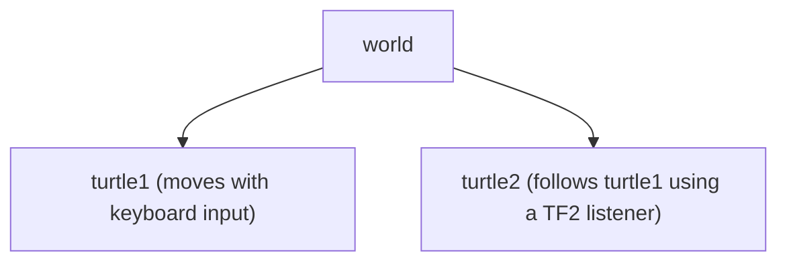

# TF2 Tutorials — ROS 2 Humble

> Based on the official ROS 2 documentation:
> https://docs.ros.org/en/humble/Tutorials/Intermediate/Tf2/Introduction-To-Tf2.html

## What is TF2?

**TF2** (Transform Library 2) is the standard ROS 2 library for managing **coordinate frame transformations**. In any robotic system, different sensors, actuators, and reference frames (world, robot base, camera, gripper, etc.) must know their position and orientation relative to each other. TF2 maintains this information in a distributed, time-aware transform tree.

### Core Capabilities

| Feature | Description |
|---------|-------------|
| **Transform tree** | A directed graph of named coordinate frames and the transforms connecting them |
| **Time travel** | Query the transform between two frames at any point in the past (within the buffer window) |
| **Distributed** | Any node can broadcast or listen to transforms across the ROS 2 network |
| **Static transforms** | Efficiently published once for fixed relationships (e.g., camera mounted on chassis) |

## Tutorial Series

Work through the tutorials in order. Each one builds on the previous:

| # | File | Topic |
|---|------|-------|
| 1 | [01_introduction.md](01_introduction.md) | What TF2 is and the turtlesim demo |
| 2 | [02_demo_walkthrough.md](02_demo_walkthrough.md) | Running the turtle-following demo step by step |
| 3 | [03_static_broadcaster.md](03_static_broadcaster.md) | Broadcasting fixed transforms (Python & C++) |
| 4 | [04_dynamic_broadcaster.md](04_dynamic_broadcaster.md) | Broadcasting time-varying transforms |
| 5 | [05_listener.md](05_listener.md) | Listening to and querying transforms |
| 6 | [06_tools_and_debugging.md](06_tools_and_debugging.md) | CLI tools: `view_frames`, `tf2_echo`, RViz |

## Required Packages

Install all dependencies before starting:

```bash
sudo apt-get update && sudo apt-get install -y \
    ros-humble-turtlesim \
    ros-humble-turtle-tf2-py \
    ros-humble-tf2-ros \
    ros-humble-tf2-tools \
    ros-humble-rviz2 \
    ros-humble-tf-transformations
```

> All of these are already pre-installed in the Docker image provided with this course.

## The Three Coordinate Frames

The demo and all tutorials use three frames:



- `world` is the fixed global frame
- Each turtle's broadcaster publishes `world → turtleN` at the turtle's current pose
- The follower computes `turtle1 → turtle2` from the tree and drives toward turtle1

## Quick Start

```bash
# Source ROS 2
source /opt/ros/humble/setup.bash

# Launch the demo
ros2 launch turtle_tf2_py turtle_tf2_demo.launch.py

# In a new terminal — drive turtle1
ros2 run turtlesim turtle_teleop_key
```

Watch turtle2 follow turtle1 in real time. Everything that happens is powered by TF2.
