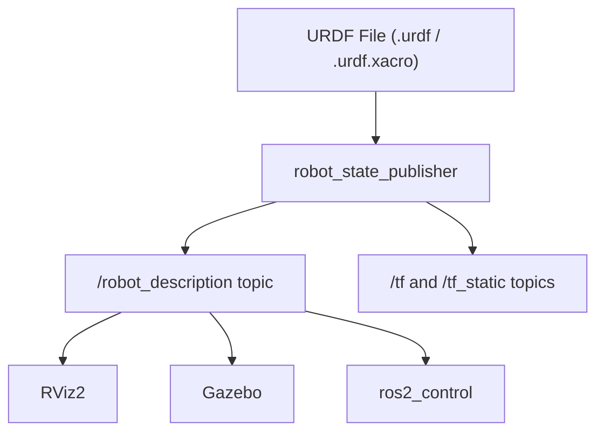

# 01 — Introduction to URDF

## What is URDF?

**URDF** (Unified Robot Description Format) is an XML file format used in ROS 2 to describe every physical aspect of a robot: its geometry, visual appearance, collision boundaries, and kinematic structure. It is the single source of truth for your robot's physical model and is consumed by multiple ROS 2 tools — from visualization in RViz to physics simulation in Gazebo.



## Core XML Structure

A URDF file always starts with the `<robot>` root element and contains two fundamental building blocks: **links** and **joints**.

```xml
<?xml version="1.0"?>
<robot name="my_robot">

  <!-- LINKS: rigid bodies (chassis, wheels, arms, sensors) -->
  <link name="base_link">
    <!-- geometry, visual, collision, inertia go here -->
  </link>

  <link name="wheel_link">
    <!-- ... -->
  </link>

  <!-- JOINTS: connections between links -->
  <joint name="wheel_joint" type="continuous">
    <parent link="base_link"/>
    <child  link="wheel_link"/>
    <origin xyz="0 0.15 0" rpy="0 0 0"/>
    <axis   xyz="0 1 0"/>
  </joint>

</robot>
```

## Links

A `<link>` represents a single rigid body. It can have three sub-elements:

| Sub-element | Purpose |
|-------------|---------|
| `<visual>` | How the link looks in RViz (geometry + material) |
| `<collision>` | Simplified geometry used for collision detection |
| `<inertial>` | Mass and inertia tensor for physics simulation |

### Primitive Geometry Types

```xml
<!-- Box -->
<geometry><box size="0.5 0.3 0.1"/></geometry>

<!-- Cylinder (along Z axis by default) -->
<geometry><cylinder radius="0.05" length="0.1"/></geometry>

<!-- Sphere -->
<geometry><sphere radius="0.05"/></geometry>

<!-- Mesh (STL or DAE file) -->
<geometry>
  <mesh filename="package://my_robot_description/meshes/base.STL"/>
</geometry>
```

## Joints

A `<joint>` defines the kinematic relationship between a parent link and a child link.

### Joint Types

| Type | Motion | Example Use |
|------|--------|-------------|
| `fixed` | No motion, rigid connection | Camera mount, caster wheel |
| `continuous` | Unlimited rotation around an axis | Drive wheels |
| `revolute` | Rotation with upper/lower angle limits | Robot arm joints |
| `prismatic` | Linear translation along an axis | Linear actuator |
| `planar` | Motion in a plane | 2D mobile base |
| `floating` | 6-DOF unconstrained | Free-floating body |

### Joint Anatomy

```xml
<joint name="arm_joint" type="revolute">
  <!-- Which links does this joint connect? -->
  <parent link="base_link"/>
  <child  link="arm_link"/>

  <!-- Where is the joint origin relative to the parent? -->
  <origin xyz="0.1 0 0.2" rpy="0 0 0"/>

  <!-- Rotation or translation axis (unit vector) -->
  <axis xyz="0 1 0"/>

  <!-- Motion limits (revolute and prismatic only) -->
  <!-- effort: max force/torque (N or N·m) -->
  <!-- velocity: max speed (rad/s or m/s) -->
  <limit lower="-1.5708" upper="1.5708" effort="10" velocity="1.0"/>
</joint>
```

## Coordinate Frames

Each link has its own coordinate frame at the link origin. Joint origins define where child frames are located relative to parent frames. Rotations use **RPY** (roll-pitch-yaw) in radians:

- **roll** — rotation around X axis
- **pitch** — rotation around Y axis
- **yaw** — rotation around Z axis

```
Z (up)
│
│
└──── Y
 \
  X (forward)
```

Convention in ROS: X forward, Y left, Z up (right-hand rule).

## URDF in a ROS 2 Workspace

### Package Structure

```
src/
└── my_robot_description/
    ├── urdf/
    │   └── my_robot.urdf
    ├── meshes/
    ├── launch/
    │   └── display.launch.py
    ├── package.xml
    └── CMakeLists.txt
```

### package.xml

```xml
<?xml version="1.0"?>
<?xml-model href="http://download.ros.org/schema/package_format3.xsd"
            schematypens="http://www.w3.org/2001/XMLSchema"?>
<package format="3">
  <name>my_robot_description</name>
  <version>0.0.1</version>
  <description>URDF description package for my_robot</description>
  <maintainer email="you@example.com">Your Name</maintainer>
  <license>Apache-2.0</license>

  <buildtool_depend>ament_cmake</buildtool_depend>

  <exec_depend>joint_state_publisher</exec_depend>
  <exec_depend>joint_state_publisher_gui</exec_depend>
  <exec_depend>robot_state_publisher</exec_depend>
  <exec_depend>rviz2</exec_depend>
  <exec_depend>urdf</exec_depend>
  <exec_depend>xacro</exec_depend>

  <export>
    <build_type>ament_cmake</build_type>
  </export>
</package>
```

### CMakeLists.txt

```cmake
cmake_minimum_required(VERSION 3.8)
project(my_robot_description)

find_package(ament_cmake REQUIRED)

# Install all directories so they are accessible via package://
install(DIRECTORY
  urdf
  meshes
  launch
  rviz
  DESTINATION share/${PROJECT_NAME}/
)

ament_package()
```

### display.launch.py

```python
import os
from ament_index_python.packages import get_package_share_directory
from launch import LaunchDescription
from launch.actions import DeclareLaunchArgument
from launch.substitutions import LaunchConfiguration, Command
from launch_ros.actions import Node


def generate_launch_description():

    pkg_share = get_package_share_directory('my_robot_description')

    # Path to the URDF file
    urdf_file = os.path.join(pkg_share, 'urdf', 'my_robot.urdf')

    # robot_state_publisher reads the URDF and publishes TF transforms
    robot_state_publisher = Node(
        package='robot_state_publisher',
        executable='robot_state_publisher',
        name='robot_state_publisher',
        parameters=[{
            'robot_description': open(urdf_file).read()
        }]
    )

    # joint_state_publisher_gui provides sliders to control joint positions
    joint_state_publisher_gui = Node(
        package='joint_state_publisher_gui',
        executable='joint_state_publisher_gui',
    )

    # RViz2 for visualization
    rviz = Node(
        package='rviz2',
        executable='rviz2',
        name='rviz2',
        arguments=['-d', os.path.join(pkg_share, 'rviz', 'my_robot.rviz')],
    )

    return LaunchDescription([
        robot_state_publisher,
        joint_state_publisher_gui,
        rviz,
    ])
```

## Validating a URDF File

```bash
# Build the workspace
cd ~/my_robot_ws
colcon build --packages-select my_robot_description
source install/setup.bash

# Check URDF structure (reports link tree and any errors)
check_urdf src/my_robot_description/urdf/my_robot.urdf

# Launch RViz visualization
ros2 launch my_robot_description display.launch.py
```

Sample output from `check_urdf`:

```
robot name is: my_robot
---------- Successfully Parsed XML ---------------
root Link: base_link has 2 child(ren)
    child(1):  wheel_left_link
    child(2):  wheel_right_link
```

## Key Topics Published by robot_state_publisher

| Topic | Type | Description |
|-------|------|-------------|
| `/robot_description` | `std_msgs/String` | Full URDF XML as a string |
| `/tf` | `tf2_msgs/TFMessage` | Dynamic transform tree |
| `/tf_static` | `tf2_msgs/TFMessage` | Fixed (static) transforms |

## Next Steps

Proceed to [02 — Building a Visual Robot Model](02_visual_robot_model.md) to start building an actual robot geometry step by step.
