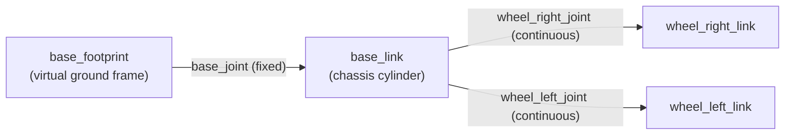

# 02 — Building a Visual Robot Model

This tutorial builds a robot visual model from scratch, progressively adding geometry, joints, materials, and mesh files. The goal is a simple two-wheeled differential drive robot similar to the **bumperbot** used throughout this course.

## Step 1 — One Shape (Single Link)

The simplest possible URDF is a single link with no joints. ROS requires at least one link; by convention it is named `base_link`.

```xml
<?xml version="1.0"?>
<robot name="simple_robot">

  <link name="base_link">
    <visual>
      <geometry>
        <cylinder radius="0.15" length="0.08"/>
      </geometry>
    </visual>
  </link>

</robot>
```

Save this as `urdf/simple_robot.urdf` and visualize it:

```bash
ros2 launch urdf_tutorial display.launch.py model:=$(pwd)/urdf/simple_robot.urdf
```

## Step 2 — Multiple Shapes (Links + Joints)

Attach additional links using joints. Every joint connects exactly one **parent** link to one **child** link.



```xml
<?xml version="1.0"?>
<robot name="simple_robot">

  <!-- Virtual ground plane frame — standard practice in mobile robots -->
  <link name="base_footprint"/>

  <link name="base_link">
    <visual>
      <geometry>
        <cylinder radius="0.15" length="0.08"/>
      </geometry>
    </visual>
  </link>

  <!-- Fixed joint lifts base_link above the ground -->
  <joint name="base_joint" type="fixed">
    <parent link="base_footprint"/>
    <child  link="base_link"/>
    <origin xyz="0 0 0.033" rpy="0 0 0"/>
  </joint>

  <!-- Right wheel -->
  <link name="wheel_right_link">
    <visual>
      <geometry>
        <cylinder radius="0.033" length="0.026"/>
      </geometry>
    </visual>
  </link>

  <joint name="wheel_right_joint" type="continuous">
    <parent link="base_link"/>
    <child  link="wheel_right_link"/>
    <origin xyz="0 -0.07 0" rpy="0 0 0"/>
    <axis   xyz="0 1 0"/>
  </joint>

  <!-- Left wheel -->
  <link name="wheel_left_link">
    <visual>
      <geometry>
        <cylinder radius="0.033" length="0.026"/>
      </geometry>
    </visual>
  </link>

  <joint name="wheel_left_joint" type="continuous">
    <parent link="base_link"/>
    <child  link="wheel_left_link"/>
    <origin xyz="0 0.07 0" rpy="0 0 0"/>
    <axis   xyz="0 1 0"/>
  </joint>

</robot>
```

## Step 3 — Origins (Positioning Geometry)

Each joint and each visual/collision element has an optional `<origin>` tag that offsets its position and orientation.

### Joint Origin

Specifies where the child frame is located **relative to the parent frame**.

```xml
<joint name="wheel_right_joint" type="continuous">
  <parent link="base_link"/>
  <child  link="wheel_right_link"/>

  <!-- Child frame is placed 7 cm to the right of the parent origin -->
  <origin xyz="0 -0.07 0" rpy="0 0 0"/>
  <axis   xyz="0 1 0"/>
</joint>
```

### Visual Origin

Offsets the rendered geometry **within the link's own frame**. This is useful when the mesh origin does not coincide with the link frame.

```xml
<link name="wheel_right_link">
  <visual>
    <!-- Rotate wheel geometry 90° around X to align cylinder axis with Y -->
    <origin xyz="0 0 0" rpy="1.5708 0 0"/>
    <geometry>
      <cylinder radius="0.033" length="0.026"/>
    </geometry>
  </visual>
</link>
```

### RPY Convention

$$
\text{rpy} = (\phi, \theta, \psi)
$$

| Angle | Axis | Notation |
|-------|------|---------|
| roll $\phi$ | X | rotation around X |
| pitch $\theta$ | Y | rotation around Y |
| yaw $\psi$ | Z | rotation around Z |

Applied in the order: roll → pitch → yaw (intrinsic Z-Y-X).

## Step 4 — Materials (Colors)

Add color to links using the `<material>` element. Materials can be defined once at the top level and referenced by name.

```xml
<?xml version="1.0"?>
<robot name="simple_robot">

  <!-- Define reusable materials -->
  <material name="blue">
    <color rgba="0.2 0.4 0.8 1.0"/>
  </material>

  <material name="dark_gray">
    <color rgba="0.2 0.2 0.2 1.0"/>
  </material>

  <material name="white">
    <color rgba="0.9 0.9 0.9 1.0"/>
  </material>

  <link name="base_link">
    <visual>
      <geometry>
        <cylinder radius="0.15" length="0.08"/>
      </geometry>
      <!-- Reference the material by name -->
      <material name="blue"/>
    </visual>
  </link>

  <link name="wheel_right_link">
    <visual>
      <origin rpy="1.5708 0 0"/>
      <geometry>
        <cylinder radius="0.033" length="0.026"/>
      </geometry>
      <material name="dark_gray"/>
    </visual>
  </link>

  <!-- ... joints ... -->

</robot>
```

### RGBA Color Values

The `rgba` attribute takes four values in the range [0, 1]:

$$
\text{rgba} = (R,\, G,\, B,\, A)
$$

where $A = 1.0$ is fully opaque and $A = 0.0$ is fully transparent.

## Step 5 — Mesh Files

Replace primitive geometry with detailed 3D mesh files (STL or DAE format). Meshes are stored in the `meshes/` directory of the description package.

```xml
<link name="base_link">
  <visual>
    <origin xyz="0 0 0" rpy="0 0 0"/>
    <geometry>
      <!-- package:// resolves to the installed share directory -->
      <mesh filename="package://my_robot_description/meshes/base_link.STL"/>
    </geometry>
    <material name="blue"/>
  </visual>
</link>
```

The `package://` URI is resolved by ROS at runtime to the package's installed `share/` directory. This requires the `meshes/` directory to be installed in `CMakeLists.txt`:

```cmake
install(DIRECTORY meshes DESTINATION share/${PROJECT_NAME}/)
```

### Mesh Format Comparison

| Format | Color Support | Used For |
|--------|--------------|---------|
| `.STL` | No (single color via material) | Collision, simple visuals |
| `.DAE` (Collada) | Yes (embedded textures) | Detailed visual models |
| `.OBJ` | Yes (with .mtl file) | External tool exports |

## Complete Example — Differential Drive Robot

Below is a complete, minimal URDF for a two-wheeled differential drive robot with colored primitive geometry:

```xml
<?xml version="1.0"?>
<robot name="bumperbot_simple">

  <!-- Materials -->
  <material name="blue">
    <color rgba="0.2 0.4 0.8 1.0"/>
  </material>
  <material name="dark">
    <color rgba="0.15 0.15 0.15 1.0"/>
  </material>

  <!-- ==================== LINKS ==================== -->

  <link name="base_footprint"/>

  <link name="base_link">
    <visual>
      <origin xyz="0 0 0" rpy="0 0 0"/>
      <geometry>
        <cylinder radius="0.15" length="0.08"/>
      </geometry>
      <material name="blue"/>
    </visual>
  </link>

  <link name="wheel_right_link">
    <visual>
      <origin xyz="0 0 0" rpy="1.5708 0 0"/>
      <geometry>
        <cylinder radius="0.033" length="0.026"/>
      </geometry>
      <material name="dark"/>
    </visual>
  </link>

  <link name="wheel_left_link">
    <visual>
      <origin xyz="0 0 0" rpy="1.5708 0 0"/>
      <geometry>
        <cylinder radius="0.033" length="0.026"/>
      </geometry>
      <material name="dark"/>
    </visual>
  </link>

  <link name="caster_front_link">
    <visual>
      <geometry>
        <sphere radius="0.015"/>
      </geometry>
      <material name="dark"/>
    </visual>
  </link>

  <!-- ==================== JOINTS ==================== -->

  <joint name="base_joint" type="fixed">
    <parent link="base_footprint"/>
    <child  link="base_link"/>
    <origin xyz="0 0 0.033" rpy="0 0 0"/>
  </joint>

  <joint name="wheel_right_joint" type="continuous">
    <parent link="base_link"/>
    <child  link="wheel_right_link"/>
    <origin xyz="0 -0.07 0" rpy="0 0 0"/>
    <axis   xyz="0 1 0"/>
  </joint>

  <joint name="wheel_left_joint" type="continuous">
    <parent link="base_link"/>
    <child  link="wheel_left_link"/>
    <origin xyz="0 0.07 0" rpy="0 0 0"/>
    <axis   xyz="0 1 0"/>
  </joint>

  <joint name="caster_front_joint" type="fixed">
    <parent link="base_link"/>
    <child  link="caster_front_link"/>
    <origin xyz="0.12 0 -0.018" rpy="0 0 0"/>
  </joint>

</robot>
```

## Workspace Setup for This Example

```
src/
└── my_robot_description/
    ├── urdf/
    │   └── my_robot.urdf          ← the file above
    ├── launch/
    │   └── display.launch.py
    ├── package.xml
    └── CMakeLists.txt
```

```bash
# Build and visualize
cd ~/my_robot_ws
colcon build --packages-select my_robot_description
source install/setup.bash
ros2 launch my_robot_description display.launch.py
```

## Next Steps

Proceed to [03 — Movable Joints](03_movable_joints.md) to learn how to configure revolute, continuous, and prismatic joints with proper limits.
