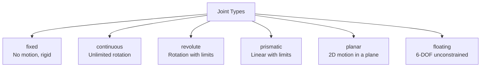
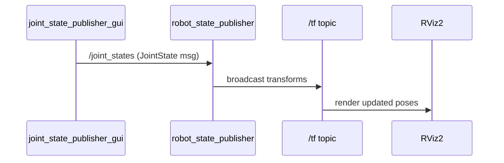

# 03 — Movable Joints

Movable joints are what make a static geometric model into an articulated robot. This tutorial covers each joint type, their limits, and how ROS 2 uses joint state messages to animate them.

## Joint Types Overview



## Continuous Joints

A **continuous** joint rotates around a defined axis with no angular limit — it can spin indefinitely. This is the standard type for drive wheels.

```xml
<joint name="wheel_right_joint" type="continuous">
  <parent link="base_link"/>
  <child  link="wheel_right_link"/>
  <origin xyz="0 -0.07 0" rpy="0 0 0"/>

  <!-- Rotation axis as a unit vector in the child link's frame -->
  <!-- xyz="0 1 0" means rotation around the Y axis -->
  <axis xyz="0 1 0"/>
</joint>
```

The `<axis>` element must be a unit vector ($\|\mathbf{a}\| = 1$) expressed in the **child link frame**.

## Revolute Joints

A **revolute** joint is like a continuous joint but with hard stops defined by `<limit>`. It is used for any rotational DOF that has physical end positions (elbow, wrist, pan-tilt cameras).

```xml
<joint name="arm_shoulder_joint" type="revolute">
  <parent link="base_link"/>
  <child  link="arm_link"/>
  <origin xyz="0.1 0 0.15" rpy="0 0 0"/>
  <axis   xyz="0 1 0"/>

  <!--
    lower / upper: angular limits in radians
    effort:        maximum torque in N·m
    velocity:      maximum speed in rad/s
  -->
  <limit lower="-1.5708" upper="1.5708" effort="10.0" velocity="1.0"/>
</joint>
```

$$
\theta \in [\theta_{\min},\, \theta_{\max}]
$$

Common angle references:

| Angle | Radians | Degrees |
|-------|---------|---------|
| $-\pi/2$ | `-1.5708` | -90° |
| $-\pi/4$ | `-0.7854` | -45° |
| $0$ | `0` | 0° |
| $\pi/4$ | `0.7854` | 45° |
| $\pi/2$ | `1.5708` | 90° |
| $\pi$ | `3.14159` | 180° |

## Prismatic Joints

A **prismatic** joint translates (slides) along an axis rather than rotating. Limits are in **meters** instead of radians.

```xml
<joint name="gripper_slide_joint" type="prismatic">
  <parent link="gripper_base_link"/>
  <child  link="gripper_finger_link"/>
  <origin xyz="0 0 0" rpy="0 0 0"/>

  <!-- Translation along X axis -->
  <axis xyz="1 0 0"/>

  <!--
    lower / upper: translation limits in meters
    effort:        maximum force in Newtons
    velocity:      maximum speed in m/s
  -->
  <limit lower="0.0" upper="0.035" effort="5.0" velocity="0.1"/>
</joint>
```

## Fixed Joints

A **fixed** joint creates a rigid connection — it has no degrees of freedom. Use it for sensors, cameras, or any permanently attached structure. Fixed joints generate a static TF transform.

```xml
<joint name="camera_joint" type="fixed">
  <parent link="base_link"/>
  <child  link="camera_link"/>
  <origin xyz="0.18 0 0.05" rpy="0 0 0"/>
</joint>
```

> **Tip:** Prefer `fixed` joints for components that never move. `robot_state_publisher` will add them to `/tf_static` automatically, without needing joint state messages.

## Complete Articulated Robot Example

Below is a URDF for a robot with a differential drive base and a simple pan-tilt camera mount, demonstrating all joint types together:

```xml
<?xml version="1.0"?>
<robot name="articulated_robot">

  <material name="blue">   <color rgba="0.2 0.4 0.8 1.0"/></material>
  <material name="dark">   <color rgba="0.15 0.15 0.15 1.0"/></material>
  <material name="white">  <color rgba="0.9 0.9 0.9 1.0"/></material>
  <material name="orange"> <color rgba="0.9 0.5 0.1 1.0"/></material>

  <!-- ==================== BASE ==================== -->

  <link name="base_footprint"/>

  <link name="base_link">
    <visual>
      <geometry><cylinder radius="0.15" length="0.08"/></geometry>
      <material name="blue"/>
    </visual>
  </link>

  <joint name="base_joint" type="fixed">
    <parent link="base_footprint"/>
    <child  link="base_link"/>
    <origin xyz="0 0 0.033" rpy="0 0 0"/>
  </joint>

  <!-- ==================== WHEELS (continuous) ==================== -->

  <link name="wheel_right_link">
    <visual>
      <origin rpy="1.5708 0 0"/>
      <geometry><cylinder radius="0.033" length="0.026"/></geometry>
      <material name="dark"/>
    </visual>
  </link>

  <joint name="wheel_right_joint" type="continuous">
    <parent link="base_link"/>
    <child  link="wheel_right_link"/>
    <origin xyz="0 -0.07 0" rpy="0 0 0"/>
    <axis   xyz="0 1 0"/>
  </joint>

  <link name="wheel_left_link">
    <visual>
      <origin rpy="1.5708 0 0"/>
      <geometry><cylinder radius="0.033" length="0.026"/></geometry>
      <material name="dark"/>
    </visual>
  </link>

  <joint name="wheel_left_joint" type="continuous">
    <parent link="base_link"/>
    <child  link="wheel_left_link"/>
    <origin xyz="0 0.07 0" rpy="0 0 0"/>
    <axis   xyz="0 1 0"/>
  </joint>

  <!-- ==================== CAMERA MAST (revolute) ==================== -->

  <link name="mast_link">
    <visual>
      <origin xyz="0 0 0.05"/>
      <geometry><box size="0.03 0.03 0.1"/></geometry>
      <material name="white"/>
    </visual>
  </link>

  <joint name="mast_joint" type="fixed">
    <parent link="base_link"/>
    <child  link="mast_link"/>
    <origin xyz="0.05 0 0.04" rpy="0 0 0"/>
  </joint>

  <!-- Pan (yaw) around Z axis — revolute with ±90° range -->
  <link name="pan_link">
    <visual>
      <geometry><box size="0.04 0.04 0.03"/></geometry>
      <material name="orange"/>
    </visual>
  </link>

  <joint name="pan_joint" type="revolute">
    <parent link="mast_link"/>
    <child  link="pan_link"/>
    <origin xyz="0 0 0.1" rpy="0 0 0"/>
    <axis   xyz="0 0 1"/>
    <limit  lower="-1.5708" upper="1.5708" effort="2.0" velocity="1.0"/>
  </joint>

  <!-- Tilt (pitch) around Y axis — revolute with -30° to +45° range -->
  <link name="camera_link">
    <visual>
      <geometry><box size="0.06 0.04 0.04"/></geometry>
      <material name="dark"/>
    </visual>
  </link>

  <joint name="tilt_joint" type="revolute">
    <parent link="pan_link"/>
    <child  link="camera_link"/>
    <origin xyz="0 0 0.03" rpy="0 0 0"/>
    <axis   xyz="0 1 0"/>
    <limit  lower="-0.5236" upper="0.7854" effort="2.0" velocity="1.0"/>
  </joint>

</robot>
```

## How Joint States Drive Animation

The `joint_state_publisher_gui` node reads all non-fixed joints from `/robot_description` and creates a slider for each one. It publishes position values on the `/joint_states` topic, which `robot_state_publisher` uses to compute and broadcast the TF tree.



### JointState Message

```
std_msgs/Header header
string[]         name      # Joint names
float64[]        position  # Angles (rad) or translations (m)
float64[]        velocity  # rad/s or m/s
float64[]        effort    # N·m or N
```

## Running the Articulated Robot

```bash
# 1. Place the URDF in your package and build
colcon build --packages-select my_robot_description
source install/setup.bash

# 2. Launch with the slider GUI
ros2 launch my_robot_description display.launch.py

# 3. In RViz: set Fixed Frame to "base_footprint"
#    Add → RobotModel → set Description Topic to /robot_description
```

## Checking Joint Limits

```bash
# List all joints and their types
check_urdf urdf/articulated_robot.urdf

# Inspect live joint state messages
ros2 topic echo /joint_states
```

## Next Steps

Proceed to [04 — Physical and Collision Properties](04_physical_properties.md) to add mass, inertia, and collision geometry so the model can be used in physics simulation.
