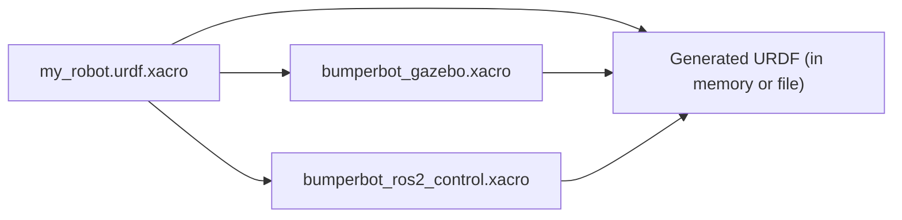

# 05 — Using Xacro to Clean Up URDF

**Xacro** (XML macro language) extends URDF with constants, math expressions, and reusable macros. It eliminates the copy-paste duplication that arises from symmetric robot parts (two wheels, two arms, mirrored joints) and makes models easier to maintain.

## Why Xacro?

A plain URDF for a symmetric robot repeats nearly identical blocks for left and right sides. With Xacro, you define the pattern once and instantiate it with different arguments.



## File Header

Always declare the Xacro namespace in the `<robot>` tag:

```xml
<?xml version="1.0"?>
<robot name="my_robot" xmlns:xacro="http://ros.org/wiki/xacro">
  <!-- ... -->
</robot>
```

## Feature 1 — Constants (Properties)

Define a named constant with `<xacro:property>` and reference it with `${name}`.

```xml
<!-- Define constants once at the top of the file -->
<xacro:property name="base_radius"   value="0.15"/>
<xacro:property name="base_length"   value="0.08"/>
<xacro:property name="wheel_radius"  value="0.033"/>
<xacro:property name="wheel_width"   value="0.026"/>
<xacro:property name="wheel_offset_y" value="0.07"/>
<xacro:property name="base_height"   value="0.033"/>

<!-- Use them anywhere in the file -->
<link name="base_link">
  <visual>
    <geometry>
      <cylinder radius="${base_radius}" length="${base_length}"/>
    </geometry>
  </visual>
</link>

<joint name="wheel_right_joint" type="continuous">
  <origin xyz="0 -${wheel_offset_y} 0" rpy="0 0 0"/>
  <!-- ... -->
</joint>
```

## Feature 2 — Math Expressions

Inside `${}` you can use standard arithmetic operators and Python's `math` module functions.

```xml
<xacro:property name="PI" value="3.14159265358979"/>
<xacro:property name="wheel_radius" value="0.033"/>
<xacro:property name="wheel_width"  value="0.026"/>

<!-- Arithmetic -->
<origin xyz="0 0 ${wheel_radius / 2}"/>

<!-- Trigonometry: 90 degrees in radians -->
<origin rpy="${PI / 2} 0 0"/>

<!-- Inertia formula: cylinder I_zz = m*r^2 / 2 -->
<xacro:property name="wheel_mass"   value="0.053"/>
<xacro:property name="wheel_izz"    value="${wheel_mass * wheel_radius * wheel_radius / 2}"/>
```

Supported operations: `+`, `-`, `*`, `/`, `**` (power), `sin()`, `cos()`, `tan()`, `sqrt()`, `fabs()`.

## Feature 3 — Macros

A **macro** is a reusable template block. Define it once with `<xacro:macro>` and call it with `<xacro:macro_name>`.

### Simple Macro (no arguments)

```xml
<!-- Define a standard inertia block for negligible-mass links -->
<xacro:macro name="inertia_zero">
  <inertial>
    <mass value="1e-6"/>
    <inertia ixx="1e-9" ixy="0" ixz="0" iyy="1e-9" iyz="0" izz="1e-9"/>
  </inertial>
</xacro:macro>

<!-- Call it -->
<link name="base_footprint">
  <xacro:inertia_zero/>
</link>
```

### Parameterized Macro (with arguments)

Use the `params` attribute to declare arguments, then reference them with `${arg_name}`.

```xml
<!-- Inertia macro for a solid cylinder, axis along Y -->
<xacro:macro name="cylinder_inertia" params="mass radius length">
  <inertial>
    <mass value="${mass}"/>
    <inertia
      ixx="${(mass / 12) * (3 * radius * radius + length * length)}"
      ixy="0"
      ixz="0"
      iyy="${mass * radius * radius / 2}"
      iyz="0"
      izz="${(mass / 12) * (3 * radius * radius + length * length)}"/>
  </inertial>
</xacro:macro>

<!-- Call with specific values -->
<link name="wheel_right_link">
  <xacro:cylinder_inertia mass="0.053" radius="0.033" length="0.026"/>
  <!-- ... visual, collision ... -->
</link>
```

### Macro with Block Parameters

Pass entire XML blocks as arguments using the `*block_name` syntax and `<xacro:insert_block name="block_name"/>`.

```xml
<xacro:macro name="sensor_mount" params="name parent *origin">
  <link name="${name}_link">
    <visual>
      <geometry><box size="0.04 0.04 0.02"/></geometry>
      <material name="dark"/>
    </visual>
  </link>

  <joint name="${name}_joint" type="fixed">
    <parent link="${parent}"/>
    <child  link="${name}_link"/>
    <xacro:insert_block name="origin"/>
  </joint>
</xacro:macro>

<!-- Call: the inner XML becomes the *origin block -->
<xacro:sensor_mount name="camera" parent="base_link">
  <origin xyz="0.18 0 0.05" rpy="0 0 0"/>
</xacro:sensor_mount>

<xacro:sensor_mount name="lidar" parent="base_link">
  <origin xyz="0.0 0 0.12" rpy="0 0 0"/>
</xacro:sensor_mount>
```

## Wheel Macro — Complete Example

This macro generates a full wheel link + joint pair for both left and right sides:

```xml
<xacro:property name="PI"              value="3.14159265358979"/>
<xacro:property name="wheel_radius"    value="0.033"/>
<xacro:property name="wheel_width"     value="0.026"/>
<xacro:property name="wheel_mass"      value="0.053"/>
<xacro:property name="wheel_offset_y"  value="0.07"/>

<xacro:macro name="wheel" params="prefix reflect">

  <link name="wheel_${prefix}_link">
    <inertial>
      <origin xyz="0 ${reflect * 0.014} 0" rpy="0 0 0"/>
      <mass value="${wheel_mass}"/>
      <inertia
        ixx="${(wheel_mass/12)*(3*wheel_radius**2 + wheel_width**2)}"
        ixy="0" ixz="0"
        iyy="${wheel_mass * wheel_radius**2 / 2}"
        iyz="0"
        izz="${(wheel_mass/12)*(3*wheel_radius**2 + wheel_width**2)}"/>
    </inertial>

    <visual>
      <origin xyz="0 0 0" rpy="${PI/2} 0 0"/>
      <geometry>
        <cylinder radius="${wheel_radius}" length="${wheel_width}"/>
      </geometry>
      <material name="dark"/>
    </visual>

    <collision>
      <origin xyz="0 ${reflect * 0.015} 0" rpy="${PI/2} 0 0"/>
      <geometry>
        <sphere radius="${wheel_radius}"/>
      </geometry>
    </collision>
  </link>

  <joint name="wheel_${prefix}_joint" type="continuous">
    <parent link="base_link"/>
    <child  link="wheel_${prefix}_link"/>
    <!-- reflect = 1 for right (negative Y), -1 for left (positive Y) -->
    <origin xyz="0 ${-reflect * wheel_offset_y} 0" rpy="0 0 0"/>
    <axis   xyz="0 1 0"/>
    <dynamics damping="0.01" friction="0.1"/>
  </joint>

</xacro:macro>

<!-- Instantiate both wheels — one call each -->
<xacro:wheel prefix="right" reflect="1"/>
<xacro:wheel prefix="left"  reflect="-1"/>
```

## Including External Xacro Files

Split a large robot description across multiple files and include them in the main file:

```xml
<?xml version="1.0"?>
<robot name="bumperbot" xmlns:xacro="http://ros.org/wiki/xacro">

  <!-- Include sub-files: Gazebo plugins and ros2_control tags -->
  <xacro:include filename="$(find bumperbot_description)/urdf/bumperbot_gazebo.xacro"/>
  <xacro:include filename="$(find bumperbot_description)/urdf/bumperbot_ros2_control.xacro"/>

  <!-- Robot body defined here -->
  <!-- ... -->

</robot>
```

The `$(find package_name)` syntax resolves to the installed share directory of the package.

## Converting Xacro to URDF

### Command Line

```bash
# Output to file
xacro my_robot.urdf.xacro > my_robot.urdf

# Output to stdout (useful for piping to check_urdf)
xacro my_robot.urdf.xacro | check_urdf /dev/stdin
```

### In a Launch File (recommended)

Use the `xacro` Python module to process the file at launch time — no intermediate `.urdf` file is created:

```python
import os
import xacro
from ament_index_python.packages import get_package_share_directory
from launch import LaunchDescription
from launch_ros.actions import Node


def generate_launch_description():

    pkg_share = get_package_share_directory('my_robot_description')
    xacro_file = os.path.join(pkg_share, 'urdf', 'my_robot.urdf.xacro')

    # Process Xacro → URDF string at launch time
    robot_description = xacro.process_file(xacro_file).toxml()

    robot_state_publisher = Node(
        package='robot_state_publisher',
        executable='robot_state_publisher',
        parameters=[{'robot_description': robot_description}],
    )

    return LaunchDescription([robot_state_publisher])
```

### Using Command Substitution in Launch Files

An alternative that works with `launch.substitutions`:

```python
from launch.substitutions import Command, FindExecutable, PathJoinSubstitution
from launch_ros.substitutions import FindPackageShare

xacro_file = PathJoinSubstitution([
    FindPackageShare('my_robot_description'),
    'urdf', 'my_robot.urdf.xacro'
])

robot_description = Command([
    FindExecutable(name='xacro'), ' ', xacro_file
])
```

## Complete Xacro Robot File

```xml
<?xml version="1.0"?>
<robot name="my_robot" xmlns:xacro="http://ros.org/wiki/xacro">

  <!-- ==================== PROPERTIES ==================== -->
  <xacro:property name="PI"             value="3.14159265358979"/>
  <xacro:property name="base_radius"    value="0.15"/>
  <xacro:property name="base_length"    value="0.08"/>
  <xacro:property name="base_mass"      value="0.82"/>
  <xacro:property name="base_height"    value="0.033"/>
  <xacro:property name="wheel_radius"   value="0.033"/>
  <xacro:property name="wheel_width"    value="0.026"/>
  <xacro:property name="wheel_mass"     value="0.053"/>
  <xacro:property name="wheel_offset_y" value="0.07"/>

  <!-- ==================== MATERIALS ==================== -->
  <material name="blue">  <color rgba="0.2 0.4 0.8 1.0"/></material>
  <material name="dark">  <color rgba="0.15 0.15 0.15 1.0"/></material>

  <!-- ==================== MACROS ==================== -->

  <xacro:macro name="wheel" params="prefix reflect">
    <link name="wheel_${prefix}_link">
      <inertial>
        <origin xyz="0 ${reflect * 0.014} 0" rpy="0 0 0"/>
        <mass value="${wheel_mass}"/>
        <inertia
          ixx="${(wheel_mass/12)*(3*wheel_radius**2 + wheel_width**2)}"
          ixy="0" ixz="0"
          iyy="${wheel_mass * wheel_radius**2 / 2}"
          iyz="0"
          izz="${(wheel_mass/12)*(3*wheel_radius**2 + wheel_width**2)}"/>
      </inertial>
      <visual>
        <origin rpy="${PI/2} 0 0"/>
        <geometry>
          <cylinder radius="${wheel_radius}" length="${wheel_width}"/>
        </geometry>
        <material name="dark"/>
      </visual>
      <collision>
        <origin xyz="0 ${reflect * 0.015} 0" rpy="${PI/2} 0 0"/>
        <geometry><sphere radius="${wheel_radius}"/></geometry>
      </collision>
    </link>

    <joint name="wheel_${prefix}_joint" type="continuous">
      <parent link="base_link"/>
      <child  link="wheel_${prefix}_link"/>
      <origin xyz="0 ${-reflect * wheel_offset_y} 0" rpy="0 0 0"/>
      <axis   xyz="0 1 0"/>
      <dynamics damping="0.01" friction="0.1"/>
    </joint>
  </xacro:macro>

  <!-- ==================== ROBOT BODY ==================== -->

  <link name="base_footprint"/>

  <link name="base_link">
    <inertial>
      <origin xyz="0 0 0.04" rpy="0 0 0"/>
      <mass value="${base_mass}"/>
      <inertia
        ixx="${(base_mass/12)*(3*base_radius**2 + base_length**2)}"
        ixy="0" ixz="0"
        iyy="${(base_mass/12)*(3*base_radius**2 + base_length**2)}"
        iyz="0"
        izz="${base_mass * base_radius**2 / 2}"/>
    </inertial>
    <visual>
      <geometry>
        <cylinder radius="${base_radius}" length="${base_length}"/>
      </geometry>
      <material name="blue"/>
    </visual>
    <collision>
      <geometry>
        <cylinder radius="${base_radius}" length="${base_length}"/>
      </geometry>
    </collision>
  </link>

  <joint name="base_joint" type="fixed">
    <parent link="base_footprint"/>
    <child  link="base_link"/>
    <origin xyz="0 0 ${base_height}" rpy="0 0 0"/>
  </joint>

  <!-- Instantiate both wheels using the macro -->
  <xacro:wheel prefix="right" reflect="1"/>
  <xacro:wheel prefix="left"  reflect="-1"/>

</robot>
```

## Debugging Xacro

```bash
# Verbose output showing each macro expansion step
xacro --debug my_robot.urdf.xacro

# Check the generated URDF is valid
xacro my_robot.urdf.xacro | check_urdf /dev/stdin

# Count lines in generated vs. source file
wc -l my_robot.urdf.xacro
xacro my_robot.urdf.xacro | wc -l
```

## Next Steps

Proceed to [06 — Robot State Publisher](06_robot_state_publisher.md) to learn how to publish TF transforms from the URDF and simulate custom joint state sequences in Python and C++.
