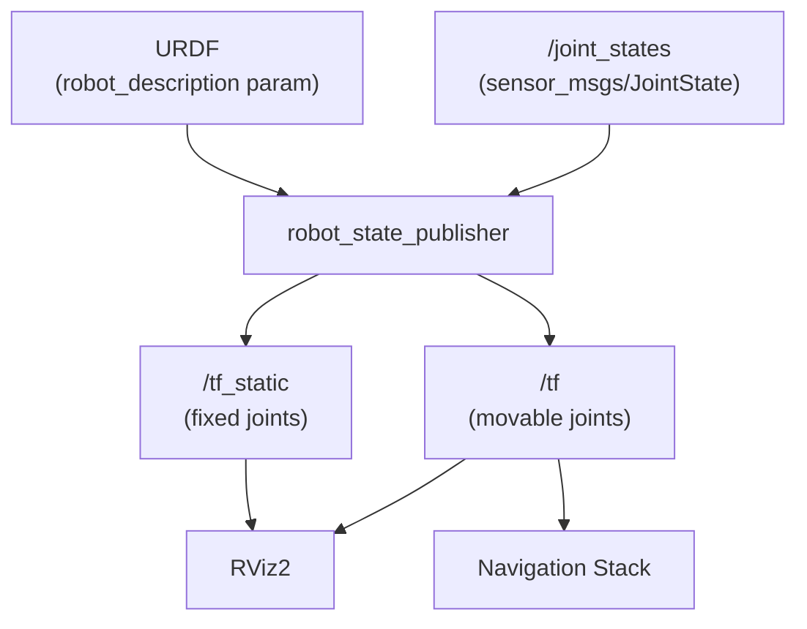

# 06 — Robot State Publisher

The `robot_state_publisher` package is the bridge between your URDF description and the rest of the ROS 2 system. It computes all coordinate frame transforms and broadcasts them on the `/tf` and `/tf_static` topics, making the robot model available to RViz, nav stacks, and any node that needs to know the robot's geometry.

## How It Works



`robot_state_publisher` does two things:

1. Parses the URDF and publishes **all fixed transforms** once on `/tf_static`
2. Listens to `/joint_states` and publishes **dynamic transforms** for each non-fixed joint at the rate they arrive

## Workspace Setup

```
src/
└── urdf_tutorial_r2d2/
    ├── urdf/
    │   └── r2d2.urdf
    ├── launch/
    │   ├── display.launch.py
    │   └── r2d2_walking.launch.py
    ├── urdf_tutorial_r2d2/
    │   ├── __init__.py
    │   └── r2d2_state_publisher.py
    ├── package.xml
    ├── setup.py
    └── setup.cfg
```

## package.xml (Python package)

```xml
<?xml version="1.0"?>
<package format="3">
  <name>urdf_tutorial_r2d2</name>
  <version>0.0.1</version>
  <description>URDF tutorial: simulating a walking robot</description>
  <maintainer email="you@example.com">Your Name</maintainer>
  <license>Apache-2.0</license>

  <depend>rclpy</depend>
  <depend>robot_state_publisher</depend>
  <depend>sensor_msgs</depend>
  <depend>geometry_msgs</depend>
  <depend>tf2_ros</depend>

  <exec_depend>joint_state_publisher_gui</exec_depend>
  <exec_depend>rviz2</exec_depend>
  <exec_depend>xacro</exec_depend>

  <test_depend>ament_copyright</test_depend>
  <test_depend>ament_flake8</test_depend>
  <test_depend>ament_pep257</test_depend>
  <test_depend>pytest</test_depend>

  <export>
    <build_type>ament_python</build_type>
  </export>
</package>
```

## setup.py (Python package)

```python
from setuptools import find_packages, setup
import os
from glob import glob

package_name = 'urdf_tutorial_r2d2'

setup(
    name=package_name,
    version='0.0.1',
    packages=find_packages(exclude=['test']),
    data_files=[
        ('share/ament_index/resource_index/packages',
            ['resource/' + package_name]),
        ('share/' + package_name, ['package.xml']),
        # Install launch files
        (os.path.join('share', package_name, 'launch'),
            glob('launch/*.launch.py')),
        # Install URDF files
        (os.path.join('share', package_name, 'urdf'),
            glob('urdf/*')),
    ],
    install_requires=['setuptools'],
    zip_safe=True,
    maintainer='Your Name',
    maintainer_email='you@example.com',
    entry_points={
        'console_scripts': [
            'r2d2_state_publisher = urdf_tutorial_r2d2.r2d2_state_publisher:main',
        ],
    },
)
```

## Python State Publisher Node

This node simulates a walking robot by publishing joint positions and an odometry transform:

```python
#!/usr/bin/env python3
"""Simulate a walking robot by publishing joint states and odometry."""

import math
import rclpy
from rclpy.node import Node
from rclpy.time import Time
from builtin_interfaces.msg import Duration
from geometry_msgs.msg import TransformStamped
from sensor_msgs.msg import JointState
import tf2_ros


def euler_to_quaternion(roll: float, pitch: float, yaw: float) -> tuple:
    """Convert Euler angles (RPY) to quaternion (x, y, z, w)."""
    cy = math.cos(yaw * 0.5)
    sy = math.sin(yaw * 0.5)
    cp = math.cos(pitch * 0.5)
    sp = math.sin(pitch * 0.5)
    cr = math.cos(roll * 0.5)
    sr = math.sin(roll * 0.5)

    w = cy * cp * cr + sy * sp * sr
    x = cy * cp * sr - sy * sp * cr
    y = sy * cp * sr + cy * sp * cr
    z = sy * cp * cr - cy * sp * sr
    return x, y, z, w


class R2D2StatePublisher(Node):
    """Publish joint states and odom→base transform for a simulated walking robot."""

    def __init__(self):
        super().__init__('r2d2_state_publisher')

        # Publisher for joint positions
        self.joint_pub = self.create_publisher(JointState, 'joint_states', 10)

        # Broadcaster for the root transform (odom → axis)
        self.tf_broadcaster = tf2_ros.TransformBroadcaster(self)

        self.timer = self.create_timer(0.033, self.publish_state)  # ~30 Hz
        self.t = 0.0

    def publish_state(self):
        now = self.get_clock().now()

        # -------- Joint State --------
        joint_state = JointState()
        joint_state.header.stamp = now.to_msg()
        joint_state.name = ['swivel', 'tilt', 'periscope']
        joint_state.position = [
            math.sin(self.t),           # swivel: oscillates left/right
            math.sin(self.t) * 0.3,     # tilt:   small nod motion
            self.t % (2 * math.pi),     # periscope: continuous rotation
        ]
        self.joint_pub.publish(joint_state)

        # -------- Odometry Transform (odom → axis) --------
        transform = TransformStamped()
        transform.header.stamp = now.to_msg()
        transform.header.frame_id = 'odom'
        transform.child_frame_id = 'axis'

        # Robot moves in a circle
        transform.transform.translation.x = math.cos(self.t) * 2.0
        transform.transform.translation.y = math.sin(self.t) * 2.0
        transform.transform.translation.z = 0.7

        # Robot faces the direction of motion (tangent to the circle)
        qx, qy, qz, qw = euler_to_quaternion(0.0, 0.0, self.t + math.pi / 2)
        transform.transform.rotation.x = qx
        transform.transform.rotation.y = qy
        transform.transform.rotation.z = qz
        transform.transform.rotation.w = qw

        self.tf_broadcaster.sendTransform(transform)

        self.t += 0.033


def main(args=None):
    rclpy.init(args=args)
    node = R2D2StatePublisher()
    rclpy.spin(node)
    rclpy.shutdown()


if __name__ == '__main__':
    main()
```

## C++ State Publisher Node (Alternative)

```cpp
// src/r2d2_state_publisher.cpp
#include <cmath>
#include <memory>
#include <string>

#include "rclcpp/rclcpp.hpp"
#include "sensor_msgs/msg/joint_state.hpp"
#include "geometry_msgs/msg/transform_stamped.hpp"
#include "tf2_ros/transform_broadcaster.h"
#include "tf2/LinearMath/Quaternion.h"

class R2D2StatePublisher : public rclcpp::Node
{
public:
    R2D2StatePublisher() : Node("r2d2_state_publisher"), t_(0.0)
    {
        joint_pub_ = create_publisher<sensor_msgs::msg::JointState>("joint_states", 10);
        tf_broadcaster_ = std::make_unique<tf2_ros::TransformBroadcaster>(*this);
        timer_ = create_wall_timer(
            std::chrono::milliseconds(33),
            std::bind(&R2D2StatePublisher::publish_state, this));
    }

private:
    void publish_state()
    {
        auto now = get_clock()->now();

        // -------- Joint State --------
        sensor_msgs::msg::JointState js;
        js.header.stamp = now;
        js.name     = {"swivel", "tilt", "periscope"};
        js.position = {std::sin(t_), std::sin(t_) * 0.3, std::fmod(t_, 2 * M_PI)};
        joint_pub_->publish(js);

        // -------- Odometry Transform --------
        geometry_msgs::msg::TransformStamped tf;
        tf.header.stamp    = now;
        tf.header.frame_id = "odom";
        tf.child_frame_id  = "axis";

        tf.transform.translation.x = std::cos(t_) * 2.0;
        tf.transform.translation.y = std::sin(t_) * 2.0;
        tf.transform.translation.z = 0.7;

        tf2::Quaternion q;
        q.setRPY(0.0, 0.0, t_ + M_PI / 2.0);
        tf.transform.rotation.x = q.x();
        tf.transform.rotation.y = q.y();
        tf.transform.rotation.z = q.z();
        tf.transform.rotation.w = q.w();

        tf_broadcaster_->sendTransform(tf);

        t_ += 0.033;
    }

    rclcpp::Publisher<sensor_msgs::msg::JointState>::SharedPtr joint_pub_;
    std::unique_ptr<tf2_ros::TransformBroadcaster> tf_broadcaster_;
    rclcpp::TimerBase::SharedPtr timer_;
    double t_;
};

int main(int argc, char * argv[])
{
    rclcpp::init(argc, argv);
    rclcpp::spin(std::make_shared<R2D2StatePublisher>());
    rclcpp::shutdown();
    return 0;
}
```

### CMakeLists.txt (for C++ package)

```cmake
cmake_minimum_required(VERSION 3.8)
project(urdf_tutorial_r2d2_cpp)

find_package(ament_cmake REQUIRED)
find_package(rclcpp REQUIRED)
find_package(sensor_msgs REQUIRED)
find_package(geometry_msgs REQUIRED)
find_package(tf2_ros REQUIRED)
find_package(tf2 REQUIRED)

add_executable(r2d2_state_publisher src/r2d2_state_publisher.cpp)
ament_target_dependencies(r2d2_state_publisher
  rclcpp sensor_msgs geometry_msgs tf2_ros tf2)

install(TARGETS r2d2_state_publisher
  DESTINATION lib/${PROJECT_NAME})

install(DIRECTORY urdf launch rviz
  DESTINATION share/${PROJECT_NAME}/)

ament_package()
```

## Launch File

```python
# launch/r2d2_walking.launch.py
import os
import xacro
from ament_index_python.packages import get_package_share_directory
from launch import LaunchDescription
from launch_ros.actions import Node


def generate_launch_description():

    pkg_share = get_package_share_directory('urdf_tutorial_r2d2')

    # Load URDF via xacro (works for both .urdf and .urdf.xacro files)
    urdf_file = os.path.join(pkg_share, 'urdf', 'r2d2.urdf.xacro')
    robot_description = xacro.process_file(urdf_file).toxml()

    # robot_state_publisher: reads URDF + /joint_states → publishes /tf
    rsp = Node(
        package='robot_state_publisher',
        executable='robot_state_publisher',
        parameters=[{'robot_description': robot_description}],
        output='screen',
    )

    # Custom node that simulates joint motion
    sim = Node(
        package='urdf_tutorial_r2d2',
        executable='r2d2_state_publisher',
        output='screen',
    )

    # RViz for visualization
    rviz_config = os.path.join(pkg_share, 'rviz', 'r2d2.rviz')
    rviz = Node(
        package='rviz2',
        executable='rviz2',
        arguments=['-d', rviz_config],
        output='screen',
    )

    return LaunchDescription([rsp, sim, rviz])
```

## Display Launch File (with GUI sliders)

```python
# launch/display.launch.py
import os
import xacro
from ament_index_python.packages import get_package_share_directory
from launch import LaunchDescription
from launch_ros.actions import Node


def generate_launch_description():

    pkg_share = get_package_share_directory('urdf_tutorial_r2d2')
    urdf_file = os.path.join(pkg_share, 'urdf', 'r2d2.urdf.xacro')
    robot_description = xacro.process_file(urdf_file).toxml()

    rsp = Node(
        package='robot_state_publisher',
        executable='robot_state_publisher',
        parameters=[{'robot_description': robot_description}],
    )

    # GUI sliders to manually control non-fixed joints
    jsp_gui = Node(
        package='joint_state_publisher_gui',
        executable='joint_state_publisher_gui',
    )

    rviz = Node(
        package='rviz2',
        executable='rviz2',
        arguments=['-d', os.path.join(pkg_share, 'rviz', 'r2d2.rviz')],
    )

    return LaunchDescription([rsp, jsp_gui, rviz])
```

## Building and Running

```bash
# Build the package
cd ~/my_robot_ws
colcon build --packages-select urdf_tutorial_r2d2
source install/setup.bash

# Option A: interactive GUI sliders
ros2 launch urdf_tutorial_r2d2 display.launch.py

# Option B: simulated walking motion
ros2 launch urdf_tutorial_r2d2 r2d2_walking.launch.py

# Monitor joint states
ros2 topic echo /joint_states

# Monitor transforms
ros2 run tf2_tools view_frames
```

## Key Parameters of robot_state_publisher

| Parameter | Type | Description |
|-----------|------|-------------|
| `robot_description` | `string` | Full URDF XML content |
| `publish_frequency` | `double` | How often to republish TF (default: 50 Hz) |
| `ignore_timestamp` | `bool` | Publish TF even if joint state timestamps are old |

## Next Steps

Proceed to [07 — Gazebo Simulation](07_gazebo_simulation.md) to connect the URDF to a physics simulator with `ros2_control`.
