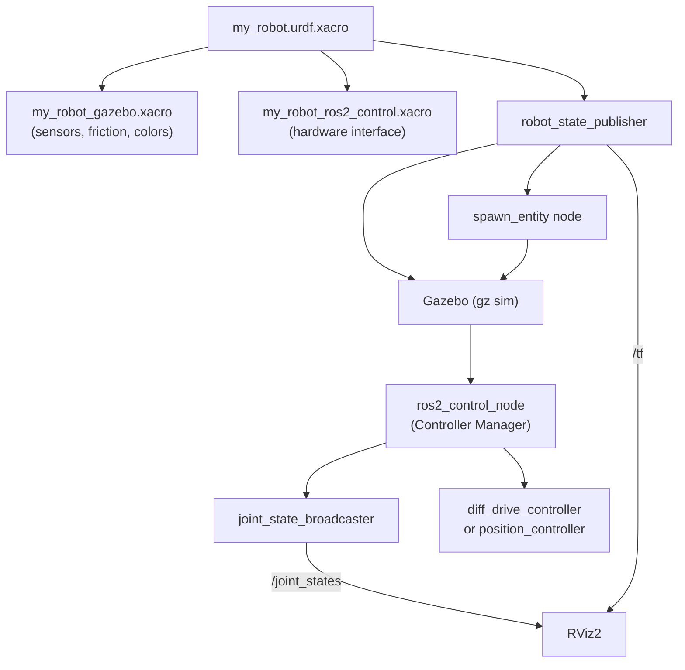

# 07 — Gazebo Simulation

Gazebo is the standard physics simulator for ROS 2. To simulate a URDF robot in Gazebo you need to add `<gazebo>` tags and configure `ros2_control` hardware interfaces. This tutorial shows how to go from a URDF model to a fully controllable simulated robot.

## Architecture Overview



## Step 1 — Gazebo Material and Surface Properties

Create `urdf/my_robot_gazebo.xacro` to override visual colors for Gazebo (Gazebo ignores URDF materials) and set surface friction:

```xml
<?xml version="1.0"?>
<robot xmlns:xacro="http://ros.org/wiki/xacro">

  <!-- Override wheel color in Gazebo (URDF <material> is ignored by Gazebo) -->
  <gazebo reference="wheel_right_link">
    <material>Gazebo/DarkGrey</material>
    <mu1>0.8</mu1>   <!-- Static friction -->
    <mu2>0.8</mu2>   <!-- Dynamic friction -->
    <kp>1e6</kp>     <!-- Contact stiffness -->
    <kd>1.0</kd>     <!-- Contact damping -->
  </gazebo>

  <gazebo reference="wheel_left_link">
    <material>Gazebo/DarkGrey</material>
    <mu1>0.8</mu1>
    <mu2>0.8</mu2>
    <kp>1e6</kp>
    <kd>1.0</kd>
  </gazebo>

  <gazebo reference="base_link">
    <material>Gazebo/Blue</material>
  </gazebo>

  <!-- Caster wheel: low friction so it slides freely -->
  <gazebo reference="caster_front_link">
    <material>Gazebo/Black</material>
    <mu1>0.001</mu1>
    <mu2>0.001</mu2>
  </gazebo>

</robot>
```

## Step 2 — ros2_control Hardware Interface

Create `urdf/my_robot_ros2_control.xacro` to declare the hardware interface that Gazebo will simulate:

```xml
<?xml version="1.0"?>
<robot xmlns:xacro="http://ros.org/wiki/xacro">

  <ros2_control name="GazeboSystem" type="system">

    <!-- Tell ros2_control to use the Gazebo simulation plugin -->
    <hardware>
      <plugin>gz_ros2_control/GazeboSimSystem</plugin>
    </hardware>

    <!-- Declare each controllable joint and its interfaces -->
    <joint name="wheel_right_joint">
      <command_interface name="velocity">
        <param name="min">-10</param>
        <param name="max">10</param>
      </command_interface>
      <state_interface name="position"/>
      <state_interface name="velocity"/>
    </joint>

    <joint name="wheel_left_joint">
      <command_interface name="velocity">
        <param name="min">-10</param>
        <param name="max">10</param>
      </command_interface>
      <state_interface name="position"/>
      <state_interface name="velocity"/>
    </joint>

  </ros2_control>

  <!-- Load the Gazebo ros2_control plugin -->
  <gazebo>
    <plugin filename="gz_ros2_control-system"
            name="gz_ros2_control::GazeboSimROS2ControlPlugin">
      <parameters>$(find my_robot_controller)/config/my_robot_controllers.yaml</parameters>
    </plugin>
  </gazebo>

</robot>
```

## Step 3 — Controller Configuration YAML

Create `config/my_robot_controllers.yaml` in the controller package:

```yaml
controller_manager:
  ros__parameters:
    update_rate: 100  # Hz

    # Declare available controllers
    joint_state_broadcaster:
      type: joint_state_broadcaster/JointStateBroadcaster

    diff_drive_controller:
      type: diff_drive_controller/DiffDriveController

# DiffDriveController parameters
diff_drive_controller:
  ros__parameters:
    left_wheel_names:  ['wheel_left_joint']
    right_wheel_names: ['wheel_right_joint']

    wheel_separation: 0.14       # meters between wheel centers
    wheel_radius:     0.033      # meters

    # Odometry settings
    odom_frame_id:  odom
    base_frame_id:  base_footprint
    pose_covariance_diagonal: [0.001, 0.001, 0.001, 0.001, 0.001, 0.01]
    twist_covariance_diagonal: [0.001, 0.001, 0.001, 0.001, 0.001, 0.01]

    # Velocity limits
    linear.x.max_velocity:  0.5
    linear.x.min_velocity: -0.5
    angular.z.max_velocity:  1.0
    angular.z.min_velocity: -1.0
```

## Step 4 — Main Xacro File

Include both sub-files from the main robot xacro:

```xml
<?xml version="1.0"?>
<robot name="my_robot" xmlns:xacro="http://ros.org/wiki/xacro">

  <!-- Include Gazebo properties and ros2_control tags -->
  <xacro:include filename="$(find my_robot_description)/urdf/my_robot_gazebo.xacro"/>
  <xacro:include filename="$(find my_robot_description)/urdf/my_robot_ros2_control.xacro"/>

  <!-- Robot body (links and joints) defined here or in another include -->
  <!-- ... -->

</robot>
```

## Step 5 — Gazebo Launch File

```python
# launch/gazebo.launch.py
import os
import xacro
from ament_index_python.packages import get_package_share_directory
from launch import LaunchDescription
from launch.actions import IncludeLaunchDescription, TimerAction
from launch.launch_description_sources import PythonLaunchDescriptionSource
from launch_ros.actions import Node


def generate_launch_description():

    pkg_desc    = get_package_share_directory('my_robot_description')
    pkg_control = get_package_share_directory('my_robot_controller')
    pkg_gazebo  = get_package_share_directory('ros_gz_sim')

    # Process Xacro → URDF string
    xacro_file = os.path.join(pkg_desc, 'urdf', 'my_robot.urdf.xacro')
    robot_description = xacro.process_file(xacro_file).toxml()

    # 1. robot_state_publisher
    rsp = Node(
        package='robot_state_publisher',
        executable='robot_state_publisher',
        parameters=[{
            'robot_description': robot_description,
            'use_sim_time': True,
        }],
    )

    # 2. Launch Gazebo with an empty world
    gazebo = IncludeLaunchDescription(
        PythonLaunchDescriptionSource(
            os.path.join(pkg_gazebo, 'launch', 'gz_sim.launch.py')
        ),
        launch_arguments={'gz_args': '-r empty.sdf'}.items(),
    )

    # 3. Spawn robot into Gazebo (reads /robot_description topic)
    spawn = Node(
        package='ros_gz_sim',
        executable='create',
        arguments=[
            '-name', 'my_robot',
            '-topic', 'robot_description',
        ],
        output='screen',
    )

    # 4. Spawn controllers (after a short delay to ensure Gazebo is ready)
    spawner_jsb = Node(
        package='controller_manager',
        executable='spawner',
        arguments=['joint_state_broadcaster'],
    )

    spawner_drive = Node(
        package='controller_manager',
        executable='spawner',
        arguments=['diff_drive_controller'],
    )

    # Delay controller spawn by 3 seconds
    delayed_controllers = TimerAction(
        period=3.0,
        actions=[spawner_jsb, spawner_drive],
    )

    return LaunchDescription([
        rsp,
        gazebo,
        spawn,
        delayed_controllers,
    ])
```

## Step 6 — Position Controller (for arm joints)

If your robot has arm joints that need position control instead of velocity control:

### ros2_control tag for position control

```xml
<joint name="arm_shoulder_joint">
  <command_interface name="position">
    <param name="min">-1.5708</param>
    <param name="max">1.5708</param>
  </command_interface>
  <state_interface name="position"/>
  <state_interface name="velocity"/>
</joint>
```

### YAML configuration

```yaml
controller_manager:
  ros__parameters:
    update_rate: 100
    joint_state_broadcaster:
      type: joint_state_broadcaster/JointStateBroadcaster
    arm_controller:
      type: position_controllers/JointGroupPositionController

arm_controller:
  ros__parameters:
    joints:
      - arm_shoulder_joint
      - arm_elbow_joint
```

## Controlling the Robot

```bash
# After launching Gazebo and spawning controllers:

# Drive forward at 0.2 m/s
ros2 topic pub /diff_drive_controller/cmd_vel geometry_msgs/msg/TwistStamped \
  '{header: {frame_id: base_link}, twist: {linear: {x: 0.2}, angular: {z: 0.0}}}'

# Rotate in place
ros2 topic pub /diff_drive_controller/cmd_vel geometry_msgs/msg/TwistStamped \
  '{header: {frame_id: base_link}, twist: {linear: {x: 0.0}, angular: {z: 0.5}}}'

# Set arm joint position
ros2 topic pub /arm_controller/commands std_msgs/msg/Float64MultiArray \
  '{data: [0.785, 0.0]}'  # 45° for shoulder, 0° for elbow
```

## Checking Simulation State

```bash
# List active controllers
ros2 control list_controllers

# Check controller state
ros2 control list_controllers --verbose

# View odometry from diff_drive_controller
ros2 topic echo /diff_drive_controller/odom

# Check joint states from broadcaster
ros2 topic echo /joint_states
```

## Common Issues

| Symptom | Likely Cause | Fix |
|---------|-------------|-----|
| Robot falls through the ground | Missing inertial tags | Add `<inertial>` to every link |
| Robot spins uncontrollably | Wheel friction too low | Increase `mu1`/`mu2` in Gazebo tags |
| Controllers fail to spawn | Timing issue | Increase `TimerAction` delay |
| Gazebo plugin not found | Missing dependency | `sudo apt install ros-humble-gz-ros2-control` |
| No `/joint_states` published | JSB not spawned | Check controller spawner output |

## Next Steps

Proceed to [08 — Exporting URDF from CAD](08_exporting_urdf.md) for information on generating URDF files automatically from 3D CAD software.
