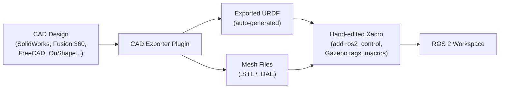

# 08 — Exporting URDF from CAD Software

Writing URDF files by hand is practical for simple robots with primitive geometry. For complex mechanical designs, it is more efficient to export URDF directly from CAD tools. This tutorial surveys the available exporters and conversion tools.

## When to Use CAD Export

| Approach | Best For |
|----------|---------|
| Hand-written URDF/Xacro | Simple geometries, primitive shapes, learning |
| CAD export | Complex mechanical parts, accurate inertia, real product designs |
| CAD export + hand-edited Xacro | Production robots: export geometry, add ROS 2 control manually |

## Workflow Overview



> **Note:** The ROS maintainers do not officially support CAD exporters. Their quality and maintenance status vary. Always validate the exported URDF with `check_urdf` and visually inspect the result in RViz.

## Available CAD Exporters

### Blender — Phobos

[Phobos](https://github.com/dfki-ric/phobos) is a Blender add-on for creating robot models.

- **Supported formats:** URDF, SDF, SMURF
- **Features:** Define links, joints, sensors, motors directly in Blender; export meshes as STL/DAE
- **Installation:**
  ```bash
  # Install as a Blender add-on (.zip file)
  # Edit → Preferences → Add-ons → Install → select phobos.zip
  ```

### SolidWorks — sw2urdf

[sw2urdf](http://wiki.ros.org/sw_urdf_exporter) is the most widely used exporter for professional mechanical design.

- **Supported versions:** SolidWorks 2019 and later
- **Features:** Automatically computes inertia tensors, exports STL meshes, configures joint types
- **Steps:**
  1. Install the sw2urdf add-in from the ROS wiki
  2. Open your assembly in SolidWorks
  3. Go to **Tools → ROS → Export as URDF**
  4. Configure joints and coordinate frames in the wizard
  5. Export to a ROS package structure

### Fusion 360 — fusion2urdf

[fusion2urdf](https://github.com/syuntoku14/fusion2urdf) exports URDF from Autodesk Fusion 360.

- **Features:** Joint detection from Fusion assemblies, STL mesh export
- **Limitations:** May require manual correction of joint axes
- **Installation:**
  ```
  Tools → Add-Ins → Scripts and Add-Ins → Add → fusion2urdf folder
  ```

### FreeCAD — FreeCAD-URDF

[FreeCAD-ROS](https://github.com/drfenixion/freecad.robotcad) provides URDF export for the open-source FreeCAD.

- **Features:** Full open-source pipeline from design to ROS
- **Steps:**
  ```bash
  pip install freecad-ros
  # Then use the Workbench → ROS menu in FreeCAD
  ```

### OnShape — onshape-to-robot

[onshape-to-robot](https://github.com/Rhoban/onshape-to-robot) converts OnShape cloud CAD assemblies directly to URDF.

- **Features:** Works with OnShape's free tier; joint detection from mates; mesh export
- **Steps:**
  ```bash
  pip install onshape-to-robot
  # Configure config.json with your OnShape document URL and API keys
  onshape-to-robot config.json
  ```

### CREO Parametric — creo2urdf

[creo2urdf](https://github.com/icub-tech-iit/creo2urdf) is developed by the iCub team for PTC CREO.

- **Best for:** Industrial robot arms and humanoids

## Format Conversion Tools

### SDF (Gazebo native) to URDF

Gazebo Classic uses SDF (Simulation Description Format) internally. To convert:

```bash
# Install the converter
sudo apt install ros-humble-sdformat-urdf

# Convert SDF to URDF
gz sdf -p my_robot.sdf > my_robot.urdf
```

### URDF to SDF (for Gazebo Ignition/Modern Gazebo)

```bash
# ign (Ignition Gazebo) can read URDF directly
# Or convert explicitly
gz sdf --check my_robot.urdf
```

### Python SDF-to-URDF converter

```bash
pip install sdf-to-urdf
sdf_to_urdf input.sdf output.urdf
```

### URDF to Webots

```bash
pip install urdf2webots
python -m urdf2webots --input=my_robot.urdf --output=my_robot.wbt
```

## Validating Exported URDF

Always validate before integrating an exported URDF into ROS 2:

```bash
# 1. Check XML syntax and joint/link tree
check_urdf my_robot.urdf

# 2. Visualize in RViz (use the display launch from tutorial 01)
ros2 launch urdf_tutorial display.launch.py model:=$(pwd)/my_robot.urdf

# 3. Check mesh files are referenced correctly
grep -o 'package://[^"]*' my_robot.urdf

# 4. Verify inertia values are physically reasonable
#    (no zero mass, no identity inertia matrices)
grep -A 3 '<inertia' my_robot.urdf
```

## Post-Export Checklist

After exporting from CAD, a hand-editing pass is usually needed:

- [ ] Convert plain `.urdf` to `.urdf.xacro` and add the Xacro namespace
- [ ] Add `<material>` tags for colors (CAD exporters often omit these)
- [ ] Add `<collision>` elements using simpler primitives where appropriate
- [ ] Add `<gazebo>` material and friction overrides (tutorial 07)
- [ ] Add `<ros2_control>` hardware interface tags (tutorial 07)
- [ ] Verify coordinate frame conventions match ROS standard (X forward, Y left, Z up)
- [ ] Verify `package://` mesh paths match the installed package name
- [ ] Check inertia tensors — CAD tools can produce tiny or zero values for thin parts

## URDF Viewers and Online Tools

| Tool | Description |
|------|-------------|
| RViz2 | Standard ROS 2 3D viewer |
| [URDF Viewer (web)](https://gkjohnson.github.io/urdf-loaders/javascript/example/bundle/index.html) | Browser-based URDF/mesh viewer |
| Foxglove Studio | Desktop URDF viewer with ROS 2 bag support |
| Jupyter URDF widget | Interactive viewer inside Jupyter notebooks |

## Recommended Workflow for Real Projects

```bash
# 1. Export from CAD to URDF
onshape-to-robot config.json   # or SolidWorks / Fusion 360 equivalent

# 2. Validate immediately
check_urdf my_robot.urdf

# 3. Convert to Xacro and split into sub-files
cp my_robot.urdf src/my_robot_description/urdf/my_robot.urdf.xacro
# Edit: add xmlns:xacro, split into gazebo and ros2_control files

# 4. Build workspace and test in RViz
colcon build --packages-select my_robot_description
source install/setup.bash
ros2 launch my_robot_description display.launch.py

# 5. Test in Gazebo
ros2 launch my_robot_description gazebo.launch.py
```

## Summary of the URDF Tutorial Series

| Tutorial | Key Takeaway |
|----------|-------------|
| 01 Introduction | URDF is the source of truth; robot_state_publisher bridges it to ROS 2 |
| 02 Visual Model | Build geometry with links, joints, materials, and meshes |
| 03 Movable Joints | Use continuous, revolute, and prismatic joints with proper limits |
| 04 Physical Properties | Add collision geometry and inertial data for physics simulation |
| 05 Xacro | Use constants, math, and macros to eliminate duplication |
| 06 Robot State Publisher | Publish TF transforms from URDF + joint states (Python and C++) |
| 07 Gazebo Simulation | Integrate ros2_control and Gazebo for full physics simulation |
| 08 CAD Export | Generate URDF from real CAD designs using the right exporter |

## References

- [Official ROS 2 URDF Tutorials](https://docs.ros.org/en/humble/Tutorials/Intermediate/URDF/URDF-Main.html)
- [URDF XML Specification](http://wiki.ros.org/urdf/XML)
- [Xacro Documentation](http://wiki.ros.org/xacro)
- [ros2_control Documentation](https://control.ros.org/humble/index.html)
- [Gazebo (Modern) Documentation](https://gazebosim.org/docs)
